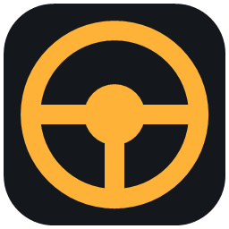
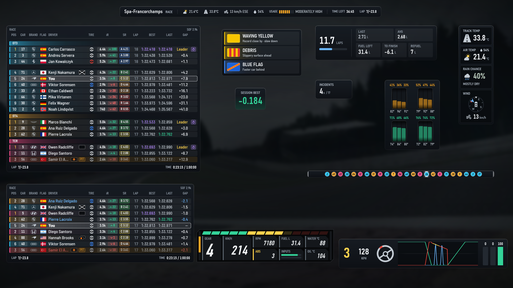
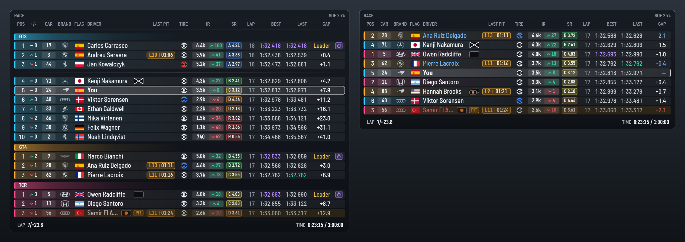
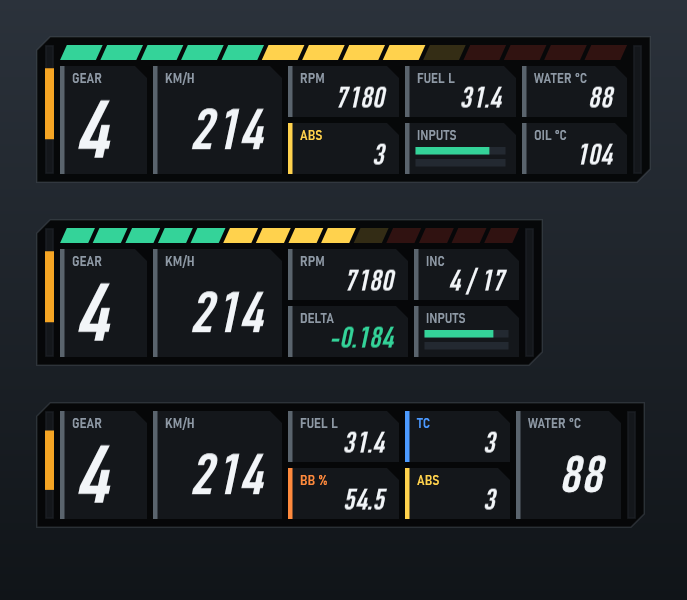
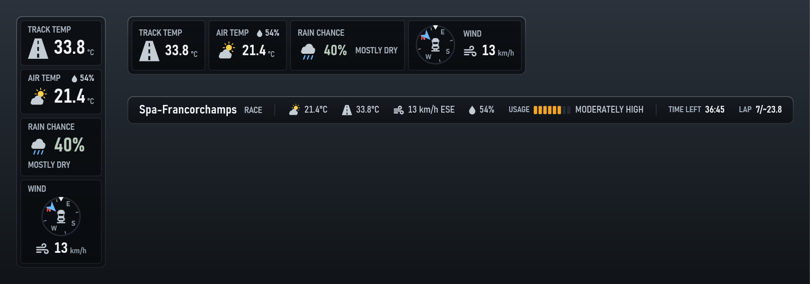
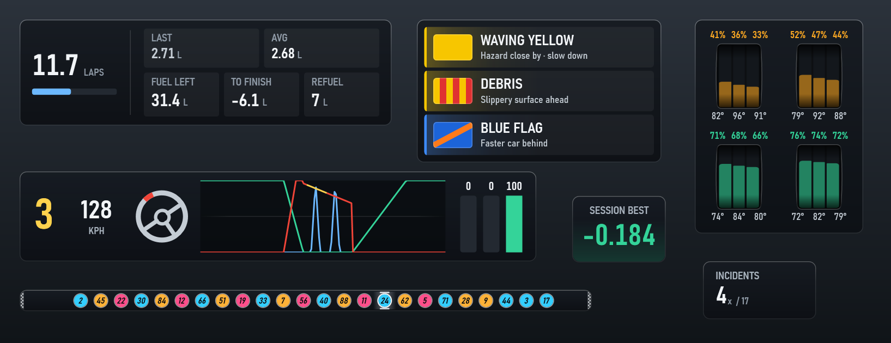
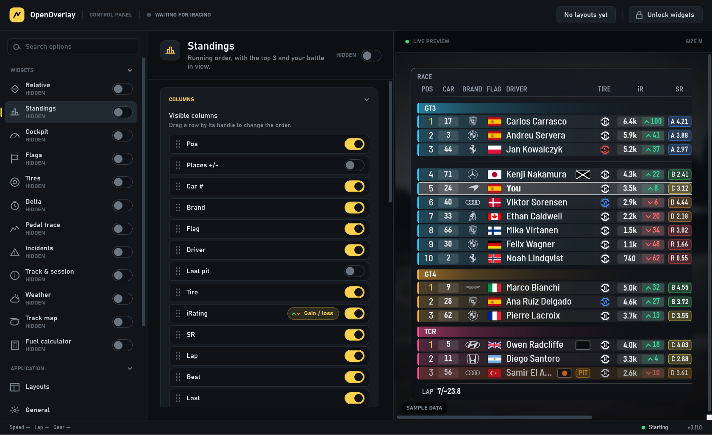
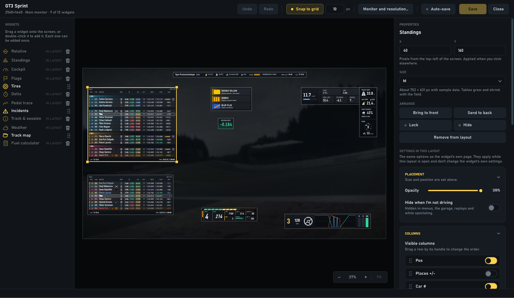
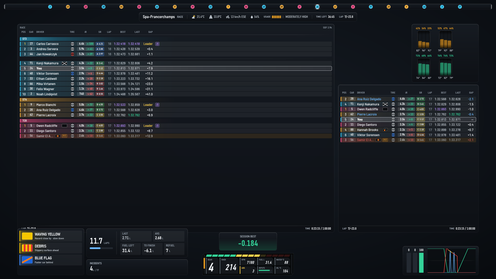

<p align="center">
  
</p>

<h1 align="center">OpenOverlay</h1>

<p align="center">
  A free, open-source telemetry overlay for iRacing — floating widgets on top of the sim, plus a
  full dashboard layout for a second monitor.
</p>

---

OpenOverlay reads iRacing's live telemetry straight from its shared-memory interface (the same
mechanism SimHub, CrewChief, and RaceLab use) and displays it as:

- **Floating widgets** — small, movable, click-through windows that sit on top of the game while
  you drive.
- **Layouts** — saved arrangements of those widgets, each with its own positions, sizes and
  settings, that you switch between in one click or with a shortcut.
- **A fullscreen dashboard** — a fixed, all-in-one layout meant for a dedicated second monitor.

No account, no cloud: no telemetry ever leaves your machine — everything is read locally from
iRacing's shared memory and rendered directly by the app.

## Screenshots

**Floating widgets** — each one is its own movable, click-through window on top of the sim:



**Standings and Relative** — class-coloured rows, car brand and country flag, places gained since
the start, last pit stop, tire compound, iRating with the estimated gain/loss, safety rating,
personal-best and session-best lap colours, penalty and PIT tags, and session info in any corner:



**Cockpit** — a modular dashboard: pick its readouts and their order, with shift lights on top and
proximity bars down the sides:



**Weather and Track & session** — four weather cards, stacked or side by side, with a wind compass
that turns with your car; and a one-line session bar with the fields you choose:



**More widgets** — Fuel calculator, Flags, Tires, Pedal trace, Delta, Incidents and Track map:



**Control Panel** — every widget has its own page with a live preview of what you're changing:



**Layout editor** — arrange a layout on a canvas at your monitor's real resolution, and set each
widget's size and settings for that layout:



**Fullscreen dashboard**, for a second monitor — track map, track info, standings, relative, tires,
flags, fuel calculator, incidents, delta, cockpit and pedals all on one screen:



<sub>Screenshots are rendered by the app itself from its built-in preview data.</sub>

## Features

### Widgets

- **Relative** — the cars around you on track, closest first, with gaps that follow each car's real
  pace around the lap (also in multiclass and after pit stops) and live race positions, so an
  overtake shows straight away.
- **Standings** — a classic timing screen: the official order and gaps update at the start/finish
  line, while pit and penalty tags stay live. Grouped by class in multiclass races, optionally with
  each class's driver count and SOF; your own battle always in view.
- **Relative and Standings columns** — position, places gained/lost since the start, car number,
  car brand, country flag, driver, last pit stop (lap and pit-lane time, e.g. `L24 | 01:18`), tire
  compound, iRating with the estimated gain/loss (calculated within each class), safety rating,
  lap, best and last lap, and gap. Show, hide and reorder them by dragging; hide the column headers
  for a shorter widget.
- **Session info around the tables** — session type, SOF, laps, time, air/track temperature,
  humidity, brake bias and your incidents, placed in any corner above or below the table.
- **Cockpit** — gear, speed, RPM, ABS, fuel, inputs, water/oil temperature, brake bias, traction
  control, incidents and delta, in the order you choose, with optional shift lights and proximity
  radar bars showing the cars alongside.
- **Delta** — live gap to your session best, all-time personal best or optimal lap, on a panel
  that turns green while you gain time and red while you lose it.
- **Fuel calculator** — fuel left, last/average/min/max use per lap, laps remaining, fuel to the
  finish and how much to add at the next stop; works in timed races, ignores refuels and out-laps,
  and lets you choose, group and reorder its cells, horizontally or vertically.
- **Flags** — every iRacing flag (track status, flags aimed at you, race progress and advisories),
  each one individually switchable, with a simulator to preview any flag without iRacing.
- **Weather** — track and air temperature, humidity, chance of rain, track wetness, wind speed and a
  wind compass relative to your car (refreshing at 10–60 Hz); every element can be hidden.
- **Track & session** — track name, session, temperatures, wind, humidity, track usage, time left
  and lap; choose and reorder the fields.
- **Tires** — temperatures and tread for every corner. On most cars iRacing only updates these in
  the pit stall.
- **Pedal trace** — scrolling throttle, brake and clutch trace with ABS activity marked, plus
  optional gear, speed and steering; choose and reorder its parts.
- **Incidents** — your incident count, and your team's in a team race.
- **Track map** — every car's position around the lap on one bar, coloured by class.

### Layouts

- Save your widgets as **layouts** — each with its own position, size, opacity, auto-hide and
  settings per widget — and switch between them from the Control Panel toolbar.
- A **layout editor** with a canvas at the real resolution of the chosen monitor: drag widgets in
  from the catalog, move them with the mouse or the arrow keys (`Shift` for a grid step), snap to a
  grid, set the stacking order, and zoom (fit, 100 % and steps in between). Changes can auto-save
  as you go, so an open layout updates on screen while you edit.
- **Export and import** layouts as files, choosing the monitor they go on.
- Give each layout its own **shortcut**, and use global ones to open/close the selected layout,
  switch to the next or previous one, or edit it.

### Control and comfort

- **Global hotkeys** for the things you need without leaving the sim. Defaults: show/hide overlays
  `Ctrl+Shift+F9`, unlock widgets `Ctrl+Shift+F10`, show the Control Panel `Ctrl+Shift+F11`, restart
  overlays `Ctrl+Shift+F8`. Every shortcut can be changed or turned off, and widgets can have their
  own.
- **System tray** — closing the Control Panel keeps the overlays running in the tray (or set it to
  exit instead).
- **Units** follow iRacing's own setting, or force metric or imperial.
- **Auto-hide** per widget when you're not driving (menus, garage, replays, spectating).
- **Opacity** per widget fades only its background, so the data stays fully readable.
- **Three dashboard themes** — Classic, Digital HUD and Raw DIY.
- **High-rate displays** (proximity bars, ABS light, pedal trace) refresh at up to ~60 Hz, or slower
  to save CPU.

### Reliability and support

- A widget that fails is paused and rebuilt on its own while every other widget keeps running;
  the connection to iRacing recovers by itself after a stall or a sim restart.
- Settings are saved crash-safe, with a backup of the previous version.
- **Logs and diagnostics** stay on your PC: one log file per day (kept 30 days), **Copy
  diagnostics** and **Export report** (a .zip with logs, crash reports and settings) for bug reports.
- **What's New, Changelog and About** — the version you're running (always in the status bar), its
  build and update channel, what changed in it, and every earlier release. After an update, a short
  notice says what's new, once.

## Requirements

- Windows 10/11 (64-bit).
- [.NET 8 Desktop Runtime](https://dotnet.microsoft.com/download/dotnet/8.0) — only if you use the
  framework-dependent release build. The self-contained build needs nothing extra.
- [iRacing](https://www.iracing.com) installed. You must actually be in a session (practice,
  qualify, race, or replay) for live data to show — at the main menu there's simply nothing to
  read yet.

## Getting started

1. Download `OpenOverlay-win-Setup.exe` from the latest [Release](../../releases) and run it. It
   installs to your user profile (no admin rights needed), adds a Desktop and Start Menu shortcut,
   and launches the app automatically when it's done. Installed copies check for new releases on
   every launch and silently update themselves in the background — nothing to do manually.
2. **Set iRacing's display mode to Borderless (or Windowed) — not exclusive Fullscreen.**
   This is the single most important setup step: exclusive Fullscreen mode takes full control of
   the display and won't let *any* other window, including OpenOverlay's widgets, render on top of
   it. In iRacing, go to **Options → Graphics → Display Mode** and pick **Borderless** (or
   **Windowed** if Borderless isn't available for your setup). Borderless is recommended since it
   still fills the screen edge-to-edge with no visible window chrome.
3. Launch OpenOverlay. The **Control Panel** opens: turn widgets on and off from the list on the
   left, and set each one up on its page while the preview shows the result. The status at the top
   says **WAITING FOR IRACING** until a session is running.
4. Load into an iRacing session. The status turns live and every widget you've enabled starts
   showing real data automatically.

### Positioning and sizing widgets

- Click **Unlock widgets** in the Control Panel toolbar (or press `Ctrl+Shift+F10`) to move them.
  While locked, widgets are click-through (mouse clicks pass straight to iRacing underneath — this
  is the mode you race in).
- Drag a widget by its body to move it.
- Widgets are **not** free-form resizable. Hover one to reveal its **−  M  +** size control and step
  through the preset sizes, from **XXS** to **XXXL**. `Ctrl` + mouse wheel does the same thing, and
  clicking the size badge resets that widget to **M**.
- The whole widget scales as one — type, padding, gaps and bars all keep the same proportions — and
  the frame always resizes itself to fit, so nothing is ever cropped, overlapped or squashed.
- Positions and sizes are saved automatically and restored next launch. For several arrangements,
  save them as layouts (see above).

### Fullscreen dashboard (second monitor)

- In the Control Panel, pick the dashboard's **Monitor** and click **Show dashboard**.
- Every dashboard panel has the same **−  M  +** size control (hover over a panel to reveal it), so
  you can rebalance the layout without any panel ever clipping its own content.
- Pick a dashboard **Theme** to restyle the whole dashboard at once; floating widgets aren't
  affected.

## Building from source

Requires the [.NET 8 SDK](https://dotnet.microsoft.com/download/dotnet/8.0).

```powershell
git clone https://github.com/andreuservera/OpenOverlay.git
cd OpenOverlay
dotnet build
dotnet test
```

To produce an optimized Release build as a loose folder of files (no installer, no auto-update):

```powershell
.\publish-release.ps1                      # framework-dependent, needs .NET 8 Desktop Runtime installed
.\publish-release.ps1 -SelfContained       # bundles the runtime, runs on a bare machine
```

The published executable lands at `publish\OpenOverlay.exe`.

To instead build the real installer (`Setup.exe`) that the Releases page ships — see
[Cutting a release](#cutting-a-release) below.

### Project layout

| Project | Purpose |
|---|---|
| `IRacingOverlay.Sdk` | Dependency-free reader for iRacing's shared-memory telemetry interface (header/variable parsing, race-free buffer reads, session-info YAML). |
| `IRacingOverlay.App` | The WPF application: widgets, dashboard, tray/control panel, settings persistence. |
| `IRacingOverlay.Sdk.Tests` / `IRacingOverlay.App.Tests` | Unit tests — the SDK tests build a synthetic shared-memory buffer in-memory, so the whole suite runs without iRacing installed. |

(The project folders/namespaces above are still named `IRacingOverlay.*` internally — only the
published app itself is branded OpenOverlay.)

## Cutting a release

Installers and auto-updates are built with [Velopack](https://velopack.io) (MIT), which packages
the app into a `Setup.exe`, creates the Desktop/Start Menu shortcuts on install, and lets installed
copies check GitHub Releases and self-update in the background — see `App.xaml.cs` for the
update-check code and `IRacingOverlay.App.csproj` for how Velopack hooks into a custom `Main`.

**Automatically (recommended):** add the release's entry at the top of
[CHANGELOG.md](CHANGELOG.md), then push a matching version tag and GitHub Actions
(`.github/workflows/release.yml`) builds and publishes the release for you:

```powershell
# CHANGELOG.md starts with "### [0.2.0] - 2026-10-01" and its changes, then:
git commit -am "Release 0.2.0"
git tag v0.2.0
git push origin main v0.2.0
```

The workflow stops if the tag doesn't match the newest entry.

**Manually**, if you want to build/test an installer locally first:

```powershell
.\pack-installer.ps1            # builds Setup.exe under .\Releases, doesn't publish
.\pack-installer.ps1 -Publish   # also uploads it as a GitHub release (needs $env:GITHUB_TOKEN)
```

The first time you ever cut a Velopack release, `vpk download github` will warn that there's no
previous release to diff against — that's expected, it just means there's no delta patch to
compute yet; every release after that will ship a small delta update instead of a full download.

### Versions

[CHANGELOG.md](CHANGELOG.md) is the only source of versions and release notes. Every build takes
its version from the newest `[X.Y.Z]` entry, and that entry is what the app shows as What's New and
what the release says on GitHub; the Changelog page shows the whole file. Headings without a
version, such as `[Unreleased]`, are ignored.

## Contributing

Contributions are very welcome — see [CONTRIBUTING.md](CONTRIBUTING.md) for how to get set up and
what to know before opening a PR.

## License

MIT — see [LICENSE](LICENSE). Use it, fork it, sell overlays built on top of it, whatever you like.

Third-party:

- [YamlDotNet](https://github.com/aaubry/YamlDotNet) (MIT), used to parse iRacing's session-info
  YAML blob.
- [Velopack](https://velopack.io) (MIT), for the installer and auto-updates.
- [SharpVectors](https://github.com/ElinamLLC/SharpVectors) (BSD-3-Clause), to draw SVG artwork.
- [Barlow Semi Condensed](https://github.com/jpt/barlow) (SIL Open Font License), the font of the
  Relative and Standings tables.
- Car brand logos: mostly [Simple Icons](https://simpleicons.org) (CC0); see
  [Assets/CarBrands/README.md](IRacingOverlay.App/Assets/CarBrands/README.md) for each source. The
  logos remain trademarks of their owners and are shown only to identify each car's make.

## Disclaimer

OpenOverlay is an unofficial, fan-made tool and is not affiliated with or endorsed by iRacing
Motorsport Simulations. It only reads the shared-memory telemetry interface iRacing itself
publishes for third-party tools (the same one SimHub, CrewChief, and every other overlay/dashboard
app uses) — it does not modify game files or memory in any way.
