# OpenOverlay — Race-Start Performance Analysis

> **Date:** 2026-09-30 · **Code analysed:** `a20e9a2` (0.8.0). The session ran builds `d58ca80`/`da7abf0`; the hot
> paths are the same, the later commits only add penalty-flag tracking and per-class fastest laps.
>
> **Method:** static review of the telemetry reader, every builder, every widget and the WPF hosting model,
> checked against the configuration actually used that day (settings files in `%LOCALAPPDATA%\IRacingOverlay`)
> and the day's run log. No profiler was attached. **Every ms, MB and redraws-per-second figure in this report is
> an estimate derived from the code**, and should be confirmed with the measurement plan in §8 before large changes.

### What the session was running

| | Value | Source |
|---|---|---|
| Widgets on | **12 of 13**, all but Track map | `widget-visibility.json` |
| High-rate refresh | **Fastest (~60 Hz)** for Cockpit and Pedal trace | `critical-refresh.txt` = `0` |
| Cockpit | **Pit Wall** theme (the most text per frame), size **XL** | `cockpit-theme.txt`, `panel-scale-level.json` |
| Sizes | Relative / Cockpit / Incident **XL** · Standings / Tires / Delta / Track info / Fuel calc **L** · Pedals / Fuel / Flags / Weather **M** | `panel-scale-level.json` |
| Weather | wind arrow **on** (animated compass) | `weather.json` |
| Standings | multiclass view, focus 4, last-pit column | `driver-tables.json` |
| Hide outside car | off for every widget, so they are drawn at all times | `hide-outside-car.json` |
| Machine | 16 logical CPUs, Windows build 26200, widgets spread over ≈3,400 px of desktop | log `env`, `layout.json` |
| Log | No read faults, no session-info repairs, no UI-watchdog stalls. The watchdog only reacts to stalls of 3 s or more and no performance data is logged, so the log can neither confirm nor rule out sub-second hitches. | `logs/openoverlay-20260930.log` |

---

# 1. Executive summary

**Telemetry math doesn't make the overlay slow.** All builders together cost well under a millisecond per tick,
even with 60 cars. Three other things do: **how much the overlay draws, how it draws, and where it waits.**

1. **It redraws too often, and every redraw goes through the most expensive window type in WPF.** All 12 widgets
   are `AllowsTransparency` windows, which are layered windows with per-pixel alpha. Every redraw is rendered on
   the GPU, **copied back to system memory** and handed to DWM. With this configuration that happens about
   **220 times per second, or about 80 MB/s of GPU→CPU copies at 100 % display scaling**. All of it goes through one
   WPF render thread, which has to wait for a GPU that iRacing is already saturating. More than a third of those
   redraws show nothing new.
2. **Three widgets redraw on every frame, whether or not their data changed.**
   - **Cockpit:** Pit Wall lays out 22 text runs per frame, and 15 of them never change. It also redraws when the
     sim tick hasn't moved.
   - **Pedal trace:** rebuilds up to four 300-point polylines with new pens every frame.
   - **Weather,** the one nobody would suspect: its wind compass starts a new 350 ms animation every 100 ms through
     every corner. It is animating for most of the lap, and redrawing its whole window on each of those frames.
3. **The telemetry thread stops publishing while it parses session info.** Every session-info update is copied,
   decoded, rewritten with a regex and fully deserialized with YamlDotNet *before* the tick that noticed it is
   published. Race starts bunch these updates together. Each update freezes every widget for tens of
   milliseconds (estimate), permanently loses pedal-trace samples, and churns the Large Object Heap.
4. **The pedal trace can't be smooth as designed.** It reads the latest snapshot once per UI frame, so any late
   frame loses sim ticks for good, and on 100 Hz and 165 Hz monitors it loses ticks even when idle. Per frame, it
   is also the most expensive thing to render.
5. **The timing tables repaint every tick, even when nothing changed.** Each tick replaces the rows with new
   objects, and their colour properties are strings. WPF converts each string into a new brush on every binding,
   on every tick. At the start the rows also change identity every tick, so every cell is laid out again.

**Why the start, and why it recovers after lap 1.** Most of the overlay's cost is roughly constant. iRacing's isn't:
a packed field is its heaviest moment on both GPU and CPU. The overlay's fixed GPU/compositor cost therefore lands
exactly when iRacing has no headroom, and stops mattering once the field spreads out, although nothing in the
overlay changed. On top of that, a few overlay costs really do spike at the start: session-info bursts (R2), table
churn (R5), and pedal-trace brake lines split into ABS segments under heavy braking (R4).

**iRacing's "HIGH CPU USAGE" warning.** The overlay only reads iRacing's data: a read-only memory mapping plus a wait
on iRacing's data-ready event. It cannot make iRacing do more work. The warning stayed up after the overlay was
closed, which points at iRacing's own load. If the overlay costs iRacing frames, the GPU and DWM are the more
plausible path than CPU cores: the machine has 16 logical CPUs.

**The five changes to make first:**

| # | Change | Why first |
|---|---|---|
| 1 | Stop animating the Weather compass; update Weather at ≤ 2 Hz | Removes up to ~60 window redraws/s with a few lines |
| 2 | Cockpit: skip the frame when the sim tick hasn't advanced; cache constant text | Largest CPU and allocation cost per frame |
| 3 | Parse session info off the telemetry loop: coalesced, pooled buffers, timed | Removes the freezes specific to the start |
| 4 | Feed the pedal trace from the telemetry thread (ring buffer); draw it more cheaply | Complete trace at any frame rate |
| 5 | Frozen brushes, and skip unchanged rows in the tables | Tables stop repainting 10×/s for nothing |

After these, measure (§8) before starting the architectural work in §6.3.

---

# 2. How the pipeline works today

```mermaid
flowchart LR
    SIM[("iRacing shared memory<br/>60 Hz telemetry + session YAML")]
    subgraph READER["Telemetry thread · IRacingConnection"]
        W["Wait for data event"] --> C["Copy whole buffer<br/>(new array every tick)"]
        C --> Q{"Session info<br/>changed?"}
        Q -- yes --> P["Copy + decode + regex +<br/>full YamlDotNet parse"]
        P --> PUB["Publish Latest"]
        Q -- no --> PUB
    end
    subgraph UI["UI thread · MainWindow (one thread for every window)"]
        T10["DispatcherTimer 100 ms<br/>Background priority"] --> B10["All other widgets<br/>+ Standings at 1 Hz"]
        TF["CompositionTarget.Rendering<br/>every frame"] --> BF["Cockpit + Pedal trace"]
        B10 --> LR["Layout + OnRender<br/>12 windows"]
        BF --> LR
    end
    subgraph RT["WPF render thread (one per process)"]
        G["GPU render"] --> RB["Copy back to system memory"] --> U["UpdateLayeredWindow"]
    end
    SIM --> W
    PUB -. "polled, latest only" .-> T10
    PUB -. "polled, latest only" .-> TF
    LR --> G
    U --> DWM["DWM composes over iRacing"]
```

- **Latest-only handoff.** Widgets poll `IRacingConnection.Latest`. Ticks that arrive between two polls are
  never seen, by design.
- **One UI thread** builds state for all 12 widgets, the control panel and the dashboard, and does their layout.
  **One render thread** draws every window.
- **Blind spot in the built-in diagnostics.** The status line's `UI x/y ms` and `critical x/y ms` only time the
  builder calls and the property setters. The layout and rendering those trigger run later in the WPF frame and
  aren't counted, so the figures under-report. Only `worst gap` reflects the whole cost.

---

# 3. Symptom → cause map

| What you saw | Most likely causes (§4) |
|---|---|
| Severe iRacing FPS drop at the start | **R1** layered-window copies competing with iRacing on the GPU/DWM, inflated by **R3**; amplified by iRacing's own peak load. **R2** adds CPU bursts. |
| Better after lap 1 | iRacing's load drops; session-info bursts end (**R2**); table rows stop changing identity (**R5**). |
| Pedal trace: low refresh, occasional lag | **R4** lossy sampling and expensive drawing; **R2** telemetry freezes during YAML parses; **R6** 1 Hz spike on the same thread; **R7** GC pauses; **R1** render-thread back-pressure. |
| Other overlays sluggish at the start | **R1/R3** render thread saturated; **R5** row churn; **R6** the 10 Hz loop runs at Background priority; **R2**. |
| iRacing "HIGH CPU USAGE" | Mostly iRacing itself (persisted without the overlay). Overlay contribution via **R1/R3** (GPU/DWM) and **R2** bursts. SDK use is passive (§5). |

---

# 4. Ranked root causes (most likely first)

| Rank | Cause | Likelihood | iRacing FPS | Overlay smoothness | Worse at the start? | Fix effort |
|---:|---|---|---|---|---|---|
| R1 | ~220 layered-window redraws/s | High | **High** | **High** | Indirectly (no GPU headroom) | Low → High |
| R2 | Session-info parse blocks telemetry, churns LOH | High | Low–Med | **High** | **Yes** | Low → Med |
| R3 | Cockpit / Weather redraw every frame regardless | High | Med–High | High | Partly | **Low** |
| R4 | Pedal trace: lossy sampling, heaviest draw path | Very high (pedal symptoms) | Med | **High** | Yes (ABS segments) | Med |
| R5 | Tables repaint every tick; churn at the start | High | Med | Med–High | **Yes** | Low → Med |
| R6 | One UI thread, Background-priority loop, 1 Hz spike | Med–High | Low | Med | Partly | Low |
| R7 | Allocation rate / GC pauses | Med | Low | Med | Yes (via R2) | Low → Med |
| R8 | Frame loop never sleeps | Certain | Low | Low | No | Low |
| R9 | Hidden widgets/dashboard still updated | Conditional | Low–Med | Med | No | Low |
| R10 | Per-session constants recomputed per tick | Certain | Low | Low | Slightly | Med |
| R11 | Exceptions used as type fallback | Low (verify) | — | High if triggered | No | Low |
| R12 | Track map scales worst with car count (off this session) | Not active | Med | High when on | **Yes** | Med |

## R1 — Every redraw goes through a layered window, about 220 times per second

**Where:** [OverlayWindowBase.cs#L38](../../IRacingOverlay.App/Overlay/OverlayWindowBase.cs#L38) sets
`AllowsTransparency = true` for every widget.

**What happens.** A window with per-pixel alpha can't present through a swap chain. WPF renders it on the GPU,
then has to copy the finished bitmap back to system memory for `UpdateLayeredWindow`, and DWM uploads it again to
compose it over the game. The copy is a synchronization point: the render thread waits for the GPU to finish WPF's
commands, and those are queued behind iRacing's frame. Every window shares that one render thread. When the render
thread falls behind, WPF slows its frame loop, so every widget slows down, including the frame-synced Cockpit and
Pedal trace tick.

**Estimated redraw budget for the session's layout:**

| Widget | Scale | ≈ Window (px at 100 %) | Redraws/s | Why it redraws |
|---|---|---|---|---|
| Cockpit (Pit Wall) | XL | 905 × 135 | 60 (72 on a 144 Hz display) | Every critical tick, changed or not (R3) |
| Pedal trace | M | 390 × 175 | 60 | Every new sim tick (R4) |
| Weather | M | 230 × 290 | up to 60 | Compass animation while cornering (R3) |
| Relative | XL | 690 × 355 | 10 | New rows and new brushes every tick (R5) |
| Delta | L | small | 10 | Value really does change every tick |
| Fuel, Fuel calculator | M, L | small–medium | 10 each | Level bar `Width` changes by fractions of a pixel every tick ([FuelPanel.xaml.cs#L26](../../IRacingOverlay.App/Widgets/FuelPanel.xaml.cs#L26), [FuelCalculatorPanel.xaml.cs#L52](../../IRacingOverlay.App/Widgets/FuelCalculatorPanel.xaml.cs#L52)) |
| Standings | L | 780 × 485 | 1 | 1 Hz rebuild (R5) |
| Track info, Tires, Incident, Flags | L / L / XL / M | small | ≤ 1 | Text rarely changes |
| **Total** | | | **≈ 220/s** | **≈ 80 MB/s copied back at 100 % scaling; ×1.5–2.25 at 125–150 %** |

These are upper bounds that assume whole-window copies. For the three widgets that redraw every frame, the dirty
area is effectively the whole window anyway.

**Why it matches.** This cost is nearly constant, so it only costs frames when the GPU has none to spare, which
is the start. Render-thread back-pressure also explains why the *other* overlays feel sluggish at exactly that
moment. Separately, any window over the game forces DWM to compose every frame (no independent flip). That cost is
constant and comes with any overlay, but it is another reason why fewer and smaller redraws help.

**Fix.**
1. Remove the redraws that carry nothing: R3, R5 and the fuel bars bring the total from ~220 to ~130/s, with most
   of the remainder being real 60 Hz data.
2. Prototype a non-layered transparent window for the two 60 Hz widgets (§6.3-A).
3. Longer term, move to a composition swap chain (§6.3-B).

## R2 — Session-info parsing blocks the telemetry thread and churns the LOH

**Where:**
- [IRacingConnection.cs#L312-L313](../../IRacingOverlay.Sdk/IRacingConnection.cs#L312-L313): parse, *then* publish.
- [IRacingConnection.cs#L360](../../IRacingOverlay.Sdk/IRacingConnection.cs#L360) and
  [#L369-L370](../../IRacingOverlay.Sdk/IRacingConnection.cs#L369-L370): copy, decode and parse.
- [IrsdkParser.cs#L146-L157](../../IRacingOverlay.Sdk/Interop/IrsdkParser.cs#L146-L157): decoding.
- [SessionInfoParser.cs#L39](../../IRacingOverlay.Sdk/SessionInfoParser.cs#L39),
  [#L96](../../IRacingOverlay.Sdk/SessionInfoParser.cs#L96) and
  [#L119](../../IRacingOverlay.Sdk/SessionInfoParser.cs#L119): sanitizing and deserializing.

**What each update costs:**
1. A new `SessionInfoLen`-byte array. The code trims at the first NUL afterwards, so this is the padded region,
   not just the text. For any full grid it is above the 85 KB threshold of the **Large Object Heap**.
2. `Encoding.GetString` produces a UTF-16 string twice the YAML's size, which also lands on the LOH.
3. `Sanitize` rewrites it with a regex: another full-size string.
4. YamlDotNet parses the **whole** document. `IgnoreUnmatchedProperties`
   ([#L29](../../IRacingOverlay.Sdk/SessionInfoParser.cs#L29)) only skips *binding*: the scanner still tokenizes
   every section. That includes `CarSetup`, `SplitTimeInfo`, `CameraInfo`, `RadioInfo` and
   `QualifyResultsInfo`, about 50 fields for every driver, and one results table per session. For a 40–60-car
   field that is typically 150–250 KB of YAML. **Estimate: 10–50 ms of CPU and several MB of garbage per update**,
   more when iRacing saturates the CPU at a start.
5. Only then is the tick published. Until then `Latest` stays frozen, so Cockpit and Pedal trace stop. The reader
   only ever reads iRacing's newest buffer, so the ticks in between are **gone for good**.

**Why it matches.** iRacing rewrites the YAML whenever its content changes: the session state (grid → pace →
green), drivers joining or dropping, and the results table as cars cross the line. The start and the end of lap 1
concentrate those changes, and a bigger grid means a bigger document. The resulting LOH churn also drives gen2
garbage collections, which pause the UI thread too. The number of updates is already counted
(`ConnectionHealth.SessionInfoUpdates`), but it is never logged together with its cost.

**Fix.**
- Publish first. Parse on a worker thread; if several updates are pending, parse only the latest.
- Rent the byte buffer from `ArrayPool` and decode only up to the first NUL.
- Parse only the three sections the app reads (the section extractor already exists). Alternatively, hash each
  top-level section and re-deserialize only those that changed; during a race that is usually just `SessionInfo`.
- Log the parse time and document size.
- Longer term: a small purpose-built reader for the ~40 keys the app actually uses.

## R3 — Widgets that redraw every frame regardless of data

**R3a — Cockpit (Pit Wall, XL, ~60 Hz)**

- `CockpitBuilder.Build` runs on every critical tick, even when the sim tick hasn't advanced
  ([MainWindow.xaml.cs#L736](../../IRacingOverlay.App/MainWindow.xaml.cs#L736)). The pedal trace checks this; the
  cockpit doesn't.
- `Update` always calls `InvalidateVisual`
  ([CockpitDashboard.cs#L65-L70](../../IRacingOverlay.App/Widgets/Cockpit/CockpitDashboard.cs#L65-L70)).
- Pit Wall's `Draw` and `DrawCell` build **22 `FormattedText`s per frame**
  ([PitWallCockpit.cs#L42-L72](../../IRacingOverlay.App/Widgets/Cockpit/PitWallCockpit.cs#L42-L72),
  [CockpitDashboard.cs#L176-L189](../../IRacingOverlay.App/Widgets/Cockpit/CockpitDashboard.cs#L176-L189)).
  **15 of them never change:** the title, "CH 1–8", the column labels, the units, WAT/OIL and T/B. Each one is a
  full text-layout pass with its own glyph runs, and the SPEED/TEMPS labels are rebuilt with string interpolation
  every frame on top of that.
- The track length is parsed from its string every frame (Replace, Trim, TryParse):
  [CockpitBuilder.cs#L96](../../IRacingOverlay.App/ViewModels/CockpitBuilder.cs#L96) and
  [#L176](../../IRacingOverlay.App/ViewModels/CockpitBuilder.cs#L176).
- On a 144 Hz display the 16 ms target fires every 13.9 ms: 72 redraws/s of 60 Hz data.
- At lower refresh settings, the 30 ms ABS/shift flash timer
  ([CockpitDashboard.cs#L49](../../IRacingOverlay.App/Widgets/Cockpit/CockpitDashboard.cs#L49)) quietly raises
  the redraw rate to ~33/s under braking.

Estimate: 1–2 ms of UI thread per frame, and probably the single largest source of allocations (a few MB/s).

**R3b — Weather compass.** It is the worst value-for-cost widget in the app.

- Every 100 ms, [WeatherPanel.xaml.cs#L69](../../IRacingOverlay.App/Widgets/WeatherPanel.xaml.cs#L69) calls
  `WindCompass.Point`.
- If the heading or the wind moved by 0.5° or more, a new 350 ms `DoubleAnimation` starts
  ([WindCompass.cs#L57-L80](../../IRacingOverlay.App/Widgets/WindCompass.cs#L57-L80)). Through every corner that
  happens on every tick, so the dial is always mid-animation.
- Each animation frame runs `OnRender` with new pens and geometries
  ([#L82-L112](../../IRacingOverlay.App/Widgets/WindCompass.cs#L82-L112)), and copies the whole Weather window.

All that for a widget whose data changes over minutes.

**R3c — Pedal trace:** see R4.

**Fix.**
- Cockpit: skip `Build` and `Update` when `TickCount` equals the last one. Cache `FormattedText`: constant strings
  once, values by text, size and brush. Parse the track length once per session.
- Weather: set the angles without animation, or animate only moves larger than ~10°, and run the Weather builder
  at 1–2 Hz. Cache the compass pens as frozen objects.

## R4 — Pedal trace: lossy sampling on the UI thread, and the heaviest render path

**Sampling:** [MainWindow.xaml.cs#L689-L741](../../IRacingOverlay.App/MainWindow.xaml.cs#L689-L741),
[PedalTraceBuilder.cs#L26-L55](../../IRacingOverlay.App/ViewModels/PedalTraceBuilder.cs#L26-L55).

- The trace takes **one sample per UI frame**, read from `Latest`, while the sim produces 60 ticks/s
  independently.
- Any late frame means the ticks in between are never seen. Frames run late when:
  - the 10 Hz widgets are being laid out;
  - the 1 Hz spike runs (R6);
  - a garbage collection pauses the thread (R7);
  - the render thread pushes back (R1);
  - the reader is busy parsing YAML (R2).
- Positions are tick-based, so the time axis stays correct. The missing samples show up as straight segments and
  clipped brake peaks.
- **The sampling rate depends on the monitor.** The 16 ms target with 3 ms of slack
  ([#L693](../../IRacingOverlay.App/MainWindow.xaml.cs#L693)) samples at:
  - 60 Hz on 60, 120 and 240 Hz displays;
  - 72 Hz on 144 Hz (duplicate samples, which are harmless);
  - **55 Hz on 165 Hz and 50 Hz on 100 Hz: 1 tick in 12, or 1 in 6, dropped even when the app is idle.**

  This assumes WPF renders at the display rate; measure it with the frame counter from §8.

**Rendering, per frame:** [PedalTraceBuilder.cs#L57-L88](../../IRacingOverlay.App/ViewModels/PedalTraceBuilder.cs#L57-L88),
[PedalTraceGraph.cs#L42-L108](../../IRacingOverlay.App/Widgets/PedalTraceGraph.cs#L42-L108).

- Five new arrays copied out of the queue.
- Up to four new `StreamGeometry` objects of up to 300 points each. WPF tessellates stroked geometry on the CPU,
  on the render thread. Because the geometries are new every frame, none of that work is ever cached.
- A new, unfrozen `Pen` with round joins for every draw call ([#L107](../../IRacingOverlay.App/Widgets/PedalTraceGraph.cs#L107)),
  a new clip geometry, and a LINQ `Any()` over the clutch history.
- The brake line is split into **one geometry and one pen per ABS on/off stretch**
  ([#L67](../../IRacingOverlay.App/Widgets/PedalTraceGraph.cs#L67)). Braking into T1 with ABS modulating can mean
  dozens of draw calls per frame, exactly at the start.
- Then a whole-window layered copy (R1). Estimate: about 2 MB/s of allocations for this widget alone.

**Fix.**
1. On the telemetry thread, record `(tick, throttle, brake, clutch, abs)` for every tick into a lock-free ring
   buffer, and have the UI draw whatever the buffer holds. The trace is then complete regardless of frame timing,
   monitor refresh or UI load.
2. Run the high-rate tick when a new sim tick is available, instead of on a frame-time schedule.
3. Draw it more cheaply:
   - reuse the arrays, or draw straight from the ring buffer;
   - four cached frozen pens and `PenLineJoin.Bevel`;
   - the brake line as one geometry, with a single overlay geometry for the ABS stretches.
4. Next step: a scrolling `WriteableBitmap` that only draws the new columns each frame, or fixed chunks of frozen
   geometry under a `TranslateTransform`, so only the newest chunk is ever tessellated.

## R5 — Timing tables repaint every tick even when nothing changed

- **Relative builds the whole field every tick.** Every 100 ms, `BuildRelative` creates a new `RelativeRow` for
  **every car in the session** ([StandingsBuilder.cs#L210](../../IRacingOverlay.App/ViewModels/StandingsBuilder.cs#L210)),
  builds the results dictionary twice ([#L67](../../IRacingOverlay.App/ViewModels/StandingsBuilder.cs#L67),
  [#L113](../../IRacingOverlay.App/ViewModels/StandingsBuilder.cs#L113)) and rebuilds the standings lookup
  ([#L134](../../IRacingOverlay.App/ViewModels/StandingsBuilder.cs#L134)), then shows only 7 rows.
- **Every displayed row is replaced.**
  [RelativePanel.SetRows](../../IRacingOverlay.App/Widgets/RelativePanel.xaml.cs#L32-L46) and
  [StandingsPanel.SetRows](../../IRacingOverlay.App/Widgets/StandingsPanel.xaml.cs#L38) replace each item. As long as
  the item type is the same, WPF keeps the container and the template, but it re-evaluates all ~30 bindings and ~10
  data triggers of every row ([DriverTable.xaml#L122](../../IRacingOverlay.App/Themes/DriverTable.xaml#L122)).
  This corrects the 2026-09-29 audit: rows are only re-templated when the type changes. The real cost is the
  rebinding.
- **Colours are strings.** Five colour properties
  ([DriverRow.cs#L83-L142](../../IRacingOverlay.App/ViewModels/DriverRow.cs#L83-L142)) are bound to Brush
  properties ([DriverTable.xaml#L151](../../IRacingOverlay.App/Themes/DriverTable.xaml#L151),
  [#L222-L225](../../IRacingOverlay.App/Themes/DriverTable.xaml#L222-L225),
  [#L245-L253](../../IRacingOverlay.App/Themes/DriverTable.xaml#L245-L253),
  [#L261](../../IRacingOverlay.App/Themes/DriverTable.xaml#L261)). WPF's string-to-Brush conversion creates **a
  new unfrozen `SolidColorBrush` on every evaluation**, so every row repaints on every tick even when every value
  is identical. This is what turns Relative into a 10 Hz layered copy.
- **Display strings are recomputed on every binding evaluation**: the upper-cased, abbreviated name (`Split` +
  LINQ), lap-time formatting, licence colours
  ([DriverRow.cs#L61](../../IRacingOverlay.App/ViewModels/DriverRow.cs#L61),
  [#L151](../../IRacingOverlay.App/ViewModels/DriverRow.cs#L151)). They are constant for a session.
- **At the start, identity churns.** The rows in the window change identity on almost every tick as cars swap
  places. Every cell's text changes and is laid out again with OpenType tabular figures
  ([DesignTokens.xaml#L235](../../IRacingOverlay.App/Themes/DesignTokens.xaml#L235)), and swaps between a real row
  and a placeholder re-instantiate the template. Standings (multiclass, focus 4) does the same once per second,
  with class headers shifting too.

**Fix.**
- Low effort: make the `*Foreground` properties return static frozen brushes, or go through a caching converter
  as `ColorAlphaConverter` already does. In `SetRows`, skip items that are equal: make rows records with value
  equality over the displayed fields.
- Medium effort: stable row view models per CarIdx that raise `PropertyChanged` only for the fields that changed.
  Compute per-driver display data once per session update, and build rows only for the ~15 cars around the player.

## R6 — One UI thread, a Background-priority 10 Hz loop and a 1 Hz spike

- **The 10 Hz loop yields to the frame loop.** `_uiTimer` is a `DispatcherTimer`, whose default priority is
  Background ([MainWindow.xaml.cs#L40](../../IRacingOverlay.App/MainWindow.xaml.cs#L40)). The high-rate tick runs
  inside `CompositionTarget.Rendering` ([#L292](../../IRacingOverlay.App/MainWindow.xaml.cs#L292)). When frames get
  expensive, the 10 Hz work is postponed, so the general widgets update late and unevenly.
- **Every 10th tick is much heavier than the others.** Several jobs pile up on the same tick:
  - the standings rebuild, the multiclass view and the strength-of-field computation, done twice
    ([#L546-L590](../../IRacingOverlay.App/MainWindow.xaml.cs#L546-L590));
  - `UpdateDiagnostics`, whose `Process.GetCurrentProcess().WorkingSet64`
    ([#L754](../../IRacingOverlay.App/MainWindow.xaml.cs#L754)) queries the system-wide process table;
  - often `UpdateHealth` as well ([#L491](../../IRacingOverlay.App/MainWindow.xaml.cs#L491)).

  That is a periodic spike on the thread that also runs the 60 Hz work, which can mean a pedal-trace or cockpit
  hitch about once a second.
- **Every 10 Hz widget updates in the same frame**, instead of being spread across frames.

**Fix.**
- Run the 1 Hz jobs on different ticks instead of the same one.
- Use `Environment.WorkingSet` instead of `Process.GetCurrentProcess().WorkingSet64`.
- Update the 10 Hz widgets in turn, a few per frame, instead of all in one burst.
- Measure frame-to-frame intervals and redraw counts, not only builder time.

## R7 — Allocation rate and GC pauses

**Estimated steady-state allocation: 5–8 MB/s**, plus several MB for each session-info update, much of it on the
LOH. The main sources:
- Cockpit text (the largest).
- Pedal-trace arrays and geometry (~2 MB/s).
- Rows, brushes, closures and LINQ at 10 Hz.
- A new copy of the telemetry buffer every tick on the reader
  ([IRacingConnection.cs#L415](../../IRacingOverlay.Sdk/IRacingConnection.cs#L415)).
- A new array cache for every snapshot
  ([TelemetrySnapshot.cs#L71-L87](../../IRacingOverlay.Sdk/TelemetrySnapshot.cs#L71-L87)).

The app uses the default workstation concurrent GC. Gen0 and gen1 collections pause every managed thread,
including the UI thread and the telemetry reader, and LOH churn drives gen2 collections.

**Fix.**
- The fixes above remove most of these allocations.
- Set `GCSettings.LatencyMode = GCLatencyMode.SustainedLowLatency` while connected, which avoids blocking full
  collections.
- Pool the reader's buffers.
- Add allocated MB/s and `GC.GetTotalPauseDuration()` to the diagnostics line.

## R8 — The frame loop never sleeps

[MainWindow.xaml.cs#L292](../../IRacingOverlay.App/MainWindow.xaml.cs#L292) subscribes to
`CompositionTarget.Rendering` for the app's whole lifetime. WPF therefore runs its frame loop at the display rate
even with iRacing closed, at the menu, or with no high-rate widget on screen.

**Fix:** subscribe only while connected and while Cockpit, Pedal trace or the dashboard is visible.

## R9 — Hidden widgets and a hidden dashboard keep being built and updated

This wasn't active in the logged session: no dashboard was opened, and Track map was switched off in an earlier run.

- `WidgetOf` returns any window that has ever been created
  ([ControlPanelViewModel.cs#L137](../../IRacingOverlay.App/ControlPanel/ControlPanelViewModel.cs#L137)).
  Switching a widget off, or "hide all overlays", only hides the window
  ([WidgetSlot.cs#L247](../../IRacingOverlay.App/ControlPanel/WidgetSlot.cs#L247)).
- `Feed` treats hidden windows as live, so their builders, bindings and layout keep running.
- The dashboard is hidden, not closed ([MainWindow.xaml.cs#L814-L826](../../IRacingOverlay.App/MainWindow.xaml.cs#L814-L826)).
  Once it has been opened, it keeps receiving the full-field standings every second, Relative at 10 Hz, and
  Cockpit plus Pedal trace at 60 Hz until the app exits.

**Fix:** in `Feed`, treat a widget with `IsVisible == false` as absent, and do the same for the dashboard (or
close it when it is hidden).

## R10 — Per-session constants recomputed every tick, and work duplicated between widgets

| Recomputed | Where | How often |
|---|---|---|
| `SingleClassCarName` (LINQ over the drivers) | [MainWindow.xaml.cs#L603](../../IRacingOverlay.App/MainWindow.xaml.cs#L603), [StandingsBuilder.cs#L790](../../IRacingOverlay.App/ViewModels/StandingsBuilder.cs#L790) | 10 Hz, plus 2× per second |
| Strength of field | [MainWindow.xaml.cs#L567](../../IRacingOverlay.App/MainWindow.xaml.cs#L567), [#L581](../../IRacingOverlay.App/MainWindow.xaml.cs#L581) | 2× per second |
| Results dictionary | [CurrentSession.cs#L40](../../IRacingOverlay.App/ViewModels/CurrentSession.cs#L40) | 2× per Relative tick, plus Standings |
| `ClassColorFormat.Normalize`, then `ColorConverter` again in the converters | [StandingsBuilder.cs#L231](../../IRacingOverlay.App/ViewModels/StandingsBuilder.cs#L231) | per driver, per tick |
| Player's est. lap time, multiclass flag (LINQ) | [StandingsBuilder.cs#L79](../../IRacingOverlay.App/ViewModels/StandingsBuilder.cs#L79) | 10 Hz |
| Track length, rain %, incident limit (string parsing) | CockpitBuilder, WeatherBuilder, IncidentBuilder | 60 Hz / 10 Hz / 10 Hz |
| Penalty flags decoded | BuildRelative and PenaltyFlagTracker | 2× per tick |
| CarIdx → standings row map | [StandingsBuilder.cs#L134](../../IRacingOverlay.App/ViewModels/StandingsBuilder.cs#L134) | 10 Hz, although the data changes at 1 Hz |

**Fix:** a `SessionModel` computed once per session-info update, off the UI thread. It holds per-driver display
records (normalized colour, frozen brushes, short name, licence colour, class name), strength of field, car name,
the multiclass flag, track length, incident limit, rain %, and the results for each session. Add a CarIdx map that
is rebuilt with the standings, not on every tick.

## R11 — Exceptions used as a type fallback in 10–40 Hz code

[FlagBuilder.cs#L163-L189](../../IRacingOverlay.App/ViewModels/FlagBuilder.cs#L163-L189) and
[DeltaBuilder.cs#L42-L50](../../IRacingOverlay.App/ViewModels/DeltaBuilder.cs#L42-L50) guess a variable's type
and catch `InvalidOperationException` when the guess is wrong. If a live variable's type ever differs from the
guess, every call throws, dozens of times per second, each with a formatted message.

It is probably not happening: these variables are normally declared as bitfield or bool. But nothing would report
it if it were.

**Fix:** expose the variable type (for example `TelemetrySnapshot.TryGetType`) and branch on it once.

## R12 — Track map scales worst with car count (off in this session)

Every 100 ms, for every car ([TrackMapPanel.xaml.cs#L84-L104](../../IRacingOverlay.App/Widgets/TrackMapPanel.xaml.cs#L84-L104)):
- the class colour string is parsed with `ColorConverter`;
- a new `SolidColorBrush` is created, which forces a repaint;
- badges are pooled by **sorted index**. Whenever the order changes (constantly at a start, and every time any car
  crosses the start/finish line, since every index then shifts by one), each badge swaps its number, colour and
  size, and the player's `DropShadowEffect` is removed from one badge and recreated on another.

At XL this is a layered window about 1,100 px wide, redrawn at 10 Hz.

**Fix:** pool badges by CarIdx, cache one frozen brush per class colour, update only `Canvas.Left`, replace the
effect with a static outline, and update at 5 Hz.

## Checked and ruled out

- The iRating estimate is O(n²), but that is ~3,600 `Math.Pow` calls per second at 60 cars: negligible.
- Cockpit proximity is O(N) per frame, trivial even with the whole field alongside.
- Hotkeys use `RegisterHotKey`: no keyboard hook, no input latency added to iRacing.
- Logging writes from its own below-normal-priority thread. There is no disk I/O on the UI thread while racing;
  settings are only written when the user changes them.
- The reader waits on iRacing's data event with no busy polling. Per-car arrays are parsed once per tick and shared
  by every builder (good).
- Flags diff their list before touching the UI. Relative pads to a fixed number of rows and every table column has
  a fixed width, so `SizeToContent` never resizes a window while racing.

---

# 5. The seven focus areas at a glance

| Focus | Findings |
|---|---|
| 1. CPU-heavy calculations, loops, telemetry processing | Builders are cheap (under 1 ms/tick at 60 cars). The heavy work is YAML parsing (R2), Pit Wall text layout at 60 Hz (R3), pedal-trace geometry (R4) and table rebinding (R5). |
| 2. Scaling with car count, data volume, update rate | Relative builds a row for every car, every tick (R5). The session YAML grows with the number of drivers × sessions (R2). Track map has O(N) badge churn (R12). Cockpit, Pedals and Weather scale with the *frame* rate, not the data rate (R3, R4). |
| 3. Rendering, UI refresh, memory, GC, threading, blocking | Rendering: R1, R3, R5. GC: R7. One thread and Background priority: R6. Blocking parse: R2. |
| 4. Disproportionately expensive widgets | Weather's compass animation; Cockpit Pit Wall at XL and 60 Hz; Track map when enabled. |
| 5. Duplicated calculations | R10. When open, the dashboard repeats every widget's UI work (R9). |
| 6. Race-start conditions | Session-info bursts (R2); rows changing identity (R5); brake lines split by ABS (R4); index shifts at the start/finish line (R12); iRacing's own peak load (R1). |
| 7. iRacing SDK interaction | Passive: read-only mapping and an event wait, no broadcast messages, so no extra work inside iRacing. The costs are all on the overlay side: a new copy of the whole telemetry buffer every tick, and the whole YAML re-read and re-parsed inline for every update (R2). |

---

# 6. Recommendations

## 6.1 Low effort, high reward

| # | Change | Where | Expected effect |
|---:|---|---|---|
| 1 | Weather: set the compass angle directly, or animate only moves larger than 10°; update Weather at 1–2 Hz | [WindCompass.cs#L57](../../IRacingOverlay.App/Widgets/WindCompass.cs#L57), [MainWindow.xaml.cs#L634](../../IRacingOverlay.App/MainWindow.xaml.cs#L634) | Up to ~60 fewer window copies/s |
| 2 | Cockpit: skip `Build`/`Update` when `TickCount` is unchanged | [MainWindow.xaml.cs#L736](../../IRacingOverlay.App/MainWindow.xaml.cs#L736) | No redraws of stale data (12/s fewer at 144 Hz) |
| 3 | Cockpit: cache `FormattedText` (constants once; values by text, size and brush); parse track length once per session | [CockpitDashboard.cs#L176](../../IRacingOverlay.App/Widgets/Cockpit/CockpitDashboard.cs#L176), [CockpitBuilder.cs#L96](../../IRacingOverlay.App/ViewModels/CockpitBuilder.cs#L96) | Removes most of the Cockpit's CPU and allocations |
| 4 | Session info: publish the tick first, parse on a worker (latest update wins), `ArrayPool`, decode up to the first NUL, log parse ms | [IRacingConnection.cs#L312](../../IRacingOverlay.Sdk/IRacingConnection.cs#L312) | No telemetry freezes; far less LOH |
| 5 | Tables: frozen, cached brushes from the `*Foreground` properties; skip unchanged rows in `SetRows` | [DriverRow.cs#L83](../../IRacingOverlay.App/ViewModels/DriverRow.cs#L83), [RelativePanel.xaml.cs#L32](../../IRacingOverlay.App/Widgets/RelativePanel.xaml.cs#L32) | Relative stops repainting when nothing changed |
| 6 | Fuel bars: round the width to whole device pixels, or scale them like the pedal bars | [FuelPanel.xaml.cs#L26](../../IRacingOverlay.App/Widgets/FuelPanel.xaml.cs#L26), [FuelCalculatorPanel.xaml.cs#L52](../../IRacingOverlay.App/Widgets/FuelCalculatorPanel.xaml.cs#L52) | ~20 fewer window copies/s |
| 7 | Pedal trace: reuse arrays, four frozen pens, bevel joins, a plain loop instead of `Any()` | [PedalTraceBuilder.cs#L57](../../IRacingOverlay.App/ViewModels/PedalTraceBuilder.cs#L57), [PedalTraceGraph.cs#L55](../../IRacingOverlay.App/Widgets/PedalTraceGraph.cs#L55) | Less allocation and tessellation per frame |
| 8 | Run the 1 Hz jobs on different ticks; use `Environment.WorkingSet` | [MainWindow.xaml.cs#L546](../../IRacingOverlay.App/MainWindow.xaml.cs#L546), [#L754](../../IRacingOverlay.App/MainWindow.xaml.cs#L754) | No once-a-second hitch |
| 9 | Subscribe to `Rendering` only while connected and a high-rate widget is visible | [MainWindow.xaml.cs#L292](../../IRacingOverlay.App/MainWindow.xaml.cs#L292) | No idle frame loop |
| 10 | Don't feed hidden widgets or a hidden dashboard | [MainWindow.xaml.cs#L449](../../IRacingOverlay.App/MainWindow.xaml.cs#L449) | Removes invisible work |
| 11 | `SustainedLowLatency` GC mode while connected | startup / `Connected` handler | Avoids blocking full collections |
| 12 | Resolve variable types once instead of try/catch on every call | [FlagBuilder.cs#L163](../../IRacingOverlay.App/ViewModels/FlagBuilder.cs#L163), [DeltaBuilder.cs#L42](../../IRacingOverlay.App/ViewModels/DeltaBuilder.cs#L42) | Removes a latent exception storm |
| 13 | Write a performance line to the log every 5–10 s while connected (§8) | `UpdateDiagnostics` | The next race start can be analysed after the fact |

## 6.2 Medium effort

1. **Pedal-trace ring buffer** filled by the telemetry thread, with the high-rate tick driven by new sim ticks
   (R4).
2. **Stable row view models per CarIdx** that notify only what changed, per-driver display data computed once, and
   rows built only for the cars near the player (R5).
3. **`SessionModel`:** all per-session values derived once per session-info update, off the UI thread (R10).
4. **Section-level session-info caching:** hash each top-level block, deserialize only the ones that changed, and
   skip the sections the app doesn't use (R2).
5. **Per-widget update rates** in the widget catalogue:

   | Widgets | Rate |
   |---|---|
   | Weather, Tires, Incident, Track info | 1–2 Hz |
   | Fuel, Fuel calculator | 2–5 Hz |
   | Delta, Relative | 10 Hz |
   | Cockpit, Pedals | once per sim tick |

   Also spread the 10 Hz widgets across frames (R6).
6. **Cheaper pedal-trace drawing:** a scrolling `WriteableBitmap`, or chunked frozen geometry under a
   `TranslateTransform` (R4).
7. **Track map, when it is re-enabled:** pool by CarIdx, frozen brush per class colour, update only `Canvas.Left`,
   static outline instead of `DropShadowEffect`, 5 Hz (R12).
8. **Optional setting: run the overlay at BelowNormal process priority,** so iRacing wins when the CPU is contended.
   Test it A/B with PresentMon, since it trades overlay smoothness for sim frame rate.

## 6.3 High-impact architectural changes

- **A. Non-layered transparent windows (prototype first).**
  - Setup: `AllowsTransparency = false`, a transparent `HwndSource` background,
    `DwmExtendFrameIntoClientArea(-1)`, and `WS_EX_LAYERED | WS_EX_TRANSPARENT` with `LWA_ALPHA` 255 for
    click-through.
  - Why: WPF then presents through its normal hardware path, with no read-back at all.
  - How to prove it: try it on the Pedal trace and measure (§8). Check click-through, DPI, edit mode and
    multi-monitor.
  - If it holds up, migrate the 60 Hz widgets first.
- **B. Composition renderer.** One DirectComposition/Direct2D surface per widget (flip-model swap chains with
  premultiplied alpha), drawn from the typed frames of C. WPF would remain the control panel only. This removes
  R1 at its source.
- **C. Typed telemetry frames and a history buffer.** The reader extracts the ~60 variables actually used into a
  compact, immutable frame per tick (fixed-size CarIdx arrays) and keeps a short history. Widgets pull the latest
  frame or the history. There are no string lookups or per-tick dictionaries on the UI thread, and the pedal trace
  and any future trace get complete data for free.
- **D. Session-model pipeline.** Incremental, off the UI thread, with change detection and per-driver display data
  derived once. Widgets only ever see immutable models.
- **E. A dedicated UI thread for the high-rate widgets.** WPF allows one Dispatcher per window, so table layout,
  1 Hz jobs and allocation-heavy work on the main thread can never delay Cockpit or Pedals. Shared resources must be
  frozen for this to work.
- **F. A performance budget in CI.** Build a harness on the existing `FakeSim` / `SyntheticMemoryBuilder` that
  replays a packed 60-car start with bursts of session-info updates, and asserts on allocations per tick, UI frame
  time and redraws per second.

## 6.4 Settings the user can change today, before any code change

- **Weather:** turn off *Wind arrow*. The continuous compass animation stops immediately.
- **Cockpit:** the *Default* theme lays out 7 text runs per frame instead of Pit Wall's 22. *Invisible* applies a
  `DropShadowEffect` to the whole cockpit, which adds an off-screen pass every frame, so it is not the cheap option
  it looks like.
- **Sizes:** going from XL to L on Relative and Cockpit copies about 29 % fewer pixels per redraw.
- **Refresh rate:** keep *Fastest* if the pedal trace matters. *Fast (30 Hz)* halves the Cockpit and Pedal
  redraws, but until R4 is fixed the trace then keeps only every other tick.
- **Dashboard:** don't open it during a race unless it is used. Once opened, it stays live until the app restarts
  (R9).

---

# 7. Code areas to investigate

| File | Function / lines | What to look at |
|---|---|---|
| [IRacingConnection.cs](../../IRacingOverlay.Sdk/IRacingConnection.cs#L312-L313) | `RunConnectedLoop`, `ReadSessionInfoIfChanged` (#L350), `ReadLatestTickWithRetry` (#L397) | Parse before publish; LOH arrays; a new buffer every tick |
| [SessionInfoParser.cs](../../IRacingOverlay.Sdk/SessionInfoParser.cs#L39) | `Parse`, `Sanitize`, `Deserialize` | Full-document parse; full-size copies |
| [MainWindow.xaml.cs](../../IRacingOverlay.App/MainWindow.xaml.cs#L500) | `UiTimer_TickCore`, `OnFrame` (#L689), `CriticalTimer_TickCore` (#L727), `Feed` (#L449), `UpdateDiagnostics` (#L752) | Timer priority, 1 Hz stacking, no tick dedupe, feeding hidden windows |
| [OverlayWindowBase.cs](../../IRacingOverlay.App/Overlay/OverlayWindowBase.cs#L38) | constructor | Layered windows |
| [PitWallCockpit.cs](../../IRacingOverlay.App/Widgets/Cockpit/PitWallCockpit.cs#L42), [CockpitDashboard.cs](../../IRacingOverlay.App/Widgets/Cockpit/CockpitDashboard.cs#L65) | `Draw`, `Update`, `Text` / `Measure` | 22 text layouts per frame, unconditional invalidation |
| [WindCompass.cs](../../IRacingOverlay.App/Widgets/WindCompass.cs#L57) | `Aim`, `OnRender` | Perpetual animation; new pens every frame |
| [PedalTraceBuilder.cs](../../IRacingOverlay.App/ViewModels/PedalTraceBuilder.cs#L26), [PedalTraceGraph.cs](../../IRacingOverlay.App/Widgets/PedalTraceGraph.cs#L42) | `Build`, `Snapshot`, `OnRender`, `Line`, `Pen` | Sampling from `Latest`; per-frame arrays, geometry and pens |
| [StandingsBuilder.cs](../../IRacingOverlay.App/ViewModels/StandingsBuilder.cs#L28) | `BuildRelative`, `BuildStandings` (#L285) | A row for every car, every tick; duplicated dictionaries |
| [DriverRow.cs](../../IRacingOverlay.App/ViewModels/DriverRow.cs#L83), [DriverTable.xaml](../../IRacingOverlay.App/Themes/DriverTable.xaml#L122) | colour and display properties, row template | String → new brush on every binding; ~30 bindings per row |
| [RelativePanel.xaml.cs](../../IRacingOverlay.App/Widgets/RelativePanel.xaml.cs#L32), [StandingsPanel.xaml.cs](../../IRacingOverlay.App/Widgets/StandingsPanel.xaml.cs#L38) | `SetRows` | Replaces rows even when they are equal |
| [FuelPanel.xaml.cs](../../IRacingOverlay.App/Widgets/FuelPanel.xaml.cs#L26), [FuelCalculatorPanel.xaml.cs](../../IRacingOverlay.App/Widgets/FuelCalculatorPanel.xaml.cs#L52) | `UpdateState` | Sub-pixel width changes → layout and redraw at 10 Hz |
| [TrackMapPanel.xaml.cs](../../IRacingOverlay.App/Widgets/TrackMapPanel.xaml.cs#L84) | `UpdateBadge` | New brushes, pooled by index, effect churn |
| [ControlPanelViewModel.cs](../../IRacingOverlay.App/ControlPanel/ControlPanelViewModel.cs#L137), [WidgetSlot.cs](../../IRacingOverlay.App/ControlPanel/WidgetSlot.cs#L247) | `WidgetOf`, `Apply` | Hidden windows still count as live |
| [FlagBuilder.cs](../../IRacingOverlay.App/ViewModels/FlagBuilder.cs#L163), [DeltaBuilder.cs](../../IRacingOverlay.App/ViewModels/DeltaBuilder.cs#L42) | type fallbacks | Exceptions as control flow |

---

# 8. Measurement plan (confirm the ranking before the big changes)

1. **A repeatable scenario.** An offline AI race with a full grid (40+ cars), always the same track, car and
   graphics settings; record the first 90 s after the green. Run it three ways: overlay closed, overlay as today,
   and after each fix. A replay of a real start also works: `hide outside car` is off, so the widgets stay on
   screen.
2. **Measure iRacing.** Run PresentMon or CapFrameX on iRacing's process: average FPS, 1 % lows and frame-time
   spikes. Also watch iRacing's own FPS, CPU and GPU bars.
3. **Measure the overlay.** Add these to the diagnostics line, and write them to the log every 5 s while connected
   (a constant message with the values in `data`):
   - WPF frames per second and the worst frame interval, from the time between `CompositionTarget.Rendering`
     calls;
   - redraws per second per widget (count `OnRender` / `LayoutUpdated` per window);
   - **sim ticks dropped:** gaps in `TickCount` seen by the pedal trace, and gaps between the snapshots the
     reader publishes;
   - session-info updates, parse time (max and total) and YAML size;
   - allocated MB/s (`GC.GetTotalAllocatedBytes`), GC count per generation, GC pause ms
     (`GC.GetTotalPauseDuration`);
   - how late the 10 Hz tick runs (actual interval − 100 ms).
4. **Tools:**

   | Tool | What it shows |
   |---|---|
   | `dotnet-counters monitor -n OpenOverlay System.Runtime` | Allocation rate, gen0/1/2 collections, % time in GC, LOH size |
   | `dotnet-trace` or PerfView (CPU sampling) | Where the UI thread and the render thread spend their time |
   | Visual Studio → Performance Profiler → Application Timeline | Layout and render cost per frame |
   | WPR + WPA (GPU view) | WPF's GPU work interleaving with iRacing's |
5. **Budgets to aim for:**
   - UI thread ≤ 4 ms per frame at p99;
   - no redraw without a visible change;
   - steady allocations ≤ 1 MB/s;
   - **zero** dropped sim ticks in the pedal trace;
   - **zero** telemetry freezes caused by session info;
   - session-info parse off the telemetry thread, at ≤ 20 ms.

# 9. Suggested order of work

1. **Measure:** add the performance log line (§8), then A/B a race start with the overlay closed and with it open.
2. **Quick wins:** items 1–8 of §6.1 (Weather, Cockpit, session info off the loop, table brushes and row skipping,
   fuel bars, pedal-trace allocations, 1 Hz staggering). Measure again.
3. **Structural fixes:** the pedal-trace ring buffer, stable table rows, `SessionModel` and per-widget rates
   (§6.2).
4. **Rendering backend:** prototype the non-layered window (§6.3-A) on the Pedal trace. If it holds up, migrate the
   60 Hz widgets first, then everything else. Consider the composition renderer (§6.3-B) only if layered-window
   copies still dominate after that.
