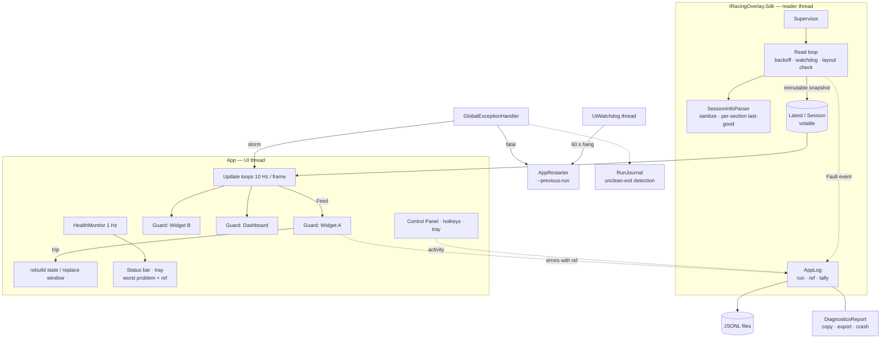

# OpenOverlay — Traceability & Error Management

> **Purpose.** Make OpenOverlay's behaviour traceable and its errors manageable in everyday use: every
> run leaves a trail that explains what happened and why, and every error is contained, identifiable,
> counted and recovered from — instead of closing the app or disappearing without a trace.
>
> Companion to [analysis_report.md](analysis_report.md) (§11 Error Handling, §14 Observability, QW1–QW4).
> Everything marked "Fixed" is implemented and covered by tests.
>
> | Check | Result |
> |---|---|
> | Solution Release build, `--no-incremental` | **0 warnings, 0 errors** |
> | Tests | **401 / 401 passing** — SDK 13 → 44, App 308 → 357 |
> | Reader-loop tests | Real named shared-memory block + data event (stall, restart, corrupt YAML, bad subscriber, sim exit); repeated runs, no flakes |
> | End to end (Windows harness) | JSONL lines carry `run` and `ref`; a stale run marker was reported as an unclean run; five identical errors became one line tallied ×5; crash report produced with masked profile path |
> | Control Panel | Rendered from production XAML: stalled-telemetry pill, live health line with error reference, General › Diagnostics |

---

## 1. Summary

**Before:** errors either closed the app or vanished without a trace — no log file, no crash report,
no version, no health state — and some silently corrupted what the user saw:

- **One unusual team name blanked every widget for the whole session.** iRacing writes driver/team names unquoted; `TeamName: [TAG] Racing` is invalid YAML. The parse exception escaped the reader, which disconnected, reconnected a second later, hit the same YAML and looped. `Team #44` was worse — valid YAML, silently read as `Team`.
- **A frozen sim was shown as live forever.** No stall detection: the same buffer was republished as "connected" every 250 ms.
- **Any exception on the UI thread closed the app** — no global handlers; both update loops, settings writes, hotkeys, tray clicks and buttons ran unguarded.
- **A corrupt settings file permanently wiped the layout** (non-atomic writes; parse failure → empty → next save overwrote it).

**Now** the work has two halves:

| | What it gives you |
|---|---|
| **Traceability** (§2) | Structured JSON logs where every line names its **run**; a **reference** on every warning/error, shown in the status bar and tray; an **activity trail** of what the user changed and what the app decided; a **run journal** that detects runs which ended without shutting down; a complete **per-run problem tally**; Copy diagnostics / Export report |
| **Error management** (§3) | Containment at every layer, automatic recovery (reconnect with backoff, per-widget circuit breakers, window replacement, crash/hang relaunch), crash-safe settings, and a health model (Healthy / Degraded / Failed) that shows the worst problem live |

**Top residual risks** (§10): second instances are now *detected and logged* but not prevented; tracker state isn't persisted across a process restart; layout-pass exceptions can't be attributed to one widget; .NET 8 EOL on Nov 10, 2026.

---

## 2. Traceability — following what happened

### 2.1 Where things are

| What | Where | Retention |
|---|---|---|
| Logs (JSON Lines) | `%LOCALAPPDATA%\IRacingOverlay\logs\openoverlay-YYYYMMDD[-N].log` | one file per day, rolled at 10 MB, **30 days**, 100 MB total |
| Crash reports | `…\logs\crashes\crash-YYYYMMDD-HHMMSS-<run>.txt` | latest 20 |
| Run journal | `…\logs\runs\<run>.run` (exists only while a run is alive, or after it ended badly) | until the next start reports it |
| Exported reports | `…\IRacingOverlay\reports\OpenOverlay-report-*.zip` | user-managed |

Control Panel › General › Diagnostics: **Copy diagnostics**, **Export report**, **Open logs folder**, and the current run ID with its error/warning counts.

### 2.2 What every log line carries

```json
{"ts":"2026-09-30T14:03:12.4873291Z","level":"Error","source":"Widget: Fuel calculator","msg":"Build failed",
 "ref":"7F3A91C2-012","run":"7F3A91C2","version":"0.6.0","env":"installed","pid":18568,"tid":1,
 "session":"Spa · Race · subsession 12345","suppressed":41,"data":{"consecutive":"3","total":"44"},
 "exception":{"type":"System.IndexOutOfRangeException","message":"…","hresult":-2146233080,"stack":"…","inner":[]}}
```

| Field | Meaning |
|---|---|
| `run` | Per-launch ID. Pulls one run out of weeks of logs; an automatic relaunch logs `previousRun`, linking the chain |
| `ref` | Warnings and errors only: `<run>-<sequence>`. The status bar, tray tooltip and reports quote it |
| `version` | Installed builds: the release version (`0.6.0`). Local builds are stamped from the latest tag: `0.4.0-dev.33+af575b8` = 33 commits after `v0.4.0`, at commit `af575b8`. `env` tells the two apart |
| `session` | Track · session type · subsession · car, when connected |
| `suppressed` | Identical entries collapsed since this one was last written (≤ 1 line/min per repeating error) |
| `exception` | Type, message, HResult, stack trace and inner exceptions (aggregates expanded). Each distinct stack trace is written once per run; later entries for the same error from the same place carry `stackRef` (the entry that has it) instead |

### 2.3 The activity trail (never collapsed)

| Recorded | Example `msg` |
|---|---|
| Every Control Panel setting, with page and group — generic, so new options are covered automatically | `Standings › Columns › iRating: off` · `Units › Units › Units: Imperial` · `General › Diagnostics › Export report: run` |
| Hotkeys pressed, shortcuts recorded/cleared, shortcuts Windows refused | `Pressed: Show / hide all overlays` · `Windows refused 1 shortcut(s): Toggle edit layout` |
| Widgets switched on/off, resized on the widget itself, closed with Alt+F4 | `Switched off` · `Widget.Fuel size: L` |
| Edit layout, hide all overlays, restart overlays, reset positions | `Edit layout on` · `Overlay windows restarted` |
| Tray menu, Control Panel opened/hidden/exit, dashboard shown/hidden/closed | `Menu: Restart overlays` · `Shown on display 2` |
| Telemetry and session lifecycle | `Connected to iRacing` · `New event; per-session state reset` · `Rejoined the same event; session state kept` |
| Health transitions and recoveries | `Overall health Healthy -> Degraded` · `Recovered` |
| Startup / shutdown with a run summary | `OpenOverlay exiting {uptime, errors, warnings, topProblem}` |

### 2.4 Runs that ended badly

At startup the [run journal](../../IRacingOverlay.App/Diagnostics/RunJournal.cs) reports, in the new run's log:
- `Run 7F3A91C2 crashed; see crash-…-7F3A91C2.txt` — a handler caught it and wrote a report.
- `Run 7F3A91C2 ended without shutting down (killed, a fault no handler can catch, or power loss)` — stack overflow, native crash, Task Manager, power cut: cases no exception handler can see.
- `Another OpenOverlay instance is running (run …, pid …)` — explains hotkey/settings contention.

### 2.5 How to trace a reported problem

1. Get the **reference** from the status bar / tray tooltip (`… · ref 7F3A91C2-012`) or the report's *Problems this run* section.
2. Open the logs folder and find the entry (PowerShell or `jq`):
   ```powershell
   Get-Content openoverlay-*.log | ConvertFrom-Json | Where-Object ref -eq '7F3A91C2-012'
   ```
   ```sh
   jq -c 'select(.ref=="7F3A91C2-012")' openoverlay-*.log
   ```
3. Read the trail around it — everything that run did, in order:
   ```sh
   jq -c 'select(.run=="7F3A91C2") | {ts,level,source,msg,ref}' openoverlay-*.log
   ```
4. If the run ended badly, the **next** run's startup entries say how, and a relaunched run names its `previousRun`.
5. To hand it over: **Export report** (report + logs + crash reports + settings, profile path masked).

---

## 3. Error management — containment, recovery, visibility

| Layer | Mechanism |
|---|---|
| iRacing SDK | Supervisor + exponential backoff with jitter; stall watchdog (Stale 5 s → release & reopen 30 s, frozen tick never republished); layout re-read on change/restart; YAML always sanitized, per-section last-good fallback; subscriber faults contained and reported via `Fault` |
| Services | Update service: cancellable, timeouts, bounded retries, never downloads while iRacing is running; UI-thread watchdog |
| Domain/builders | Each builder runs in a per-widget circuit breaker; failure → state rebuilt, previous state stays on screen |
| Widgets | Per-widget bulkhead: a failing window is replaced alone; windows closed with Alt+F4 are dropped, not reused |
| Process | Global handlers; exception-storm escalation; fatal crash or 60 s UI hang → crash report + automatic relaunch (loop-guarded) |
| Persistence | Atomic write (temp + `File.Replace`) with `.bak`; corrupt file → restore from backup; I/O failures never throw |
| Visibility | Health model per component (Healthy / Degraded / Failed) with the latest error's reference; status bar line, tray icon, reports |

---

## 4. Ranked findings

| ID | Severity | Finding (before) | Where | Status |
|---|---|---|---|---|
| R1 | **Critical** | Session-info YAML parse error disconnected telemetry and looped forever while the offending driver was in the session | `IRacingConnection.RunConnectedLoop` (parse inside the read path) | **Fixed** — [SessionInfoParser.cs](../../IRacingOverlay.Sdk/SessionInfoParser.cs#L39), [IRacingConnection.cs](../../IRacingOverlay.Sdk/IRacingConnection.cs#L341) |
| R2 | **Critical** | No global exception handlers; one UI-thread exception closed the app | [App.xaml.cs](../../IRacingOverlay.App/App.xaml.cs#L26) | **Fixed** — [GlobalExceptionHandler.cs](../../IRacingOverlay.App/Diagnostics/GlobalExceptionHandler.cs) |
| R3 | **Critical** | Update loops unguarded: any builder/widget exception propagated to the dispatcher | `MainWindow.UiTimer_Tick`, `OnFrame` | **Fixed** — per-widget guards, [MainWindow.xaml.cs](../../IRacingOverlay.App/MainWindow.xaml.cs#L409) |
| R4 | **Critical** | Hung sim: frozen snapshot republished as live, indefinitely | `ReadLatestTickWithRetry` + loop | **Fixed** — watchdog + `_stalledAtTick`, [IRacingConnection.cs](../../IRacingOverlay.Sdk/IRacingConnection.cs#L318) |
| R5 | **Critical** | No evidence of any failure: no log file, crash report, version or health state | — | **Fixed** — [Diagnostics/](../../IRacingOverlay.App/Diagnostics/) (§2) |
| R6 | High | Settings writes threw `IOException`/`UnauthorizedAccessException` into UI handlers (AV/OneDrive lock, disk full) → crash; corrupt file silently reset and was overwritten | 15 `*Store` classes | **Fixed** — [SettingsFile.cs](../../IRacingOverlay.App/Overlay/SettingsFile.cs) |
| R7 | High | Throwing `TelemetryUpdated`/`Connected` subscriber tore the connection down each tick | SDK event invocation | **Fixed** — per-subscriber containment, `Fault` event |
| R8 | High | Var headers cached per mapping handle; sim restarted in place → stale offsets → garbage values | SDK | **Fixed** — tick-restart detection, header match, 5 s byte-compare (`VarLayout`) |
| R9 | High | Widget closed with Alt+F4 (edit mode) left a dead window in its slot; next `Show()` threw `InvalidOperationException` | [WidgetSlot.cs](../../IRacingOverlay.App/ControlPanel/WidgetSlot.cs#L339) | **Fixed** — slot drops the window and switches the widget off (logged) |
| R10 | High | Same for the dashboard (closed window reused) | `MainWindow.CreateDashboard` | **Fixed** — [MainWindow.xaml.cs](../../IRacingOverlay.App/MainWindow.xaml.cs#L789) |
| R11 | High | Tray-menu exceptions showed WinForms' modal "Continue/Quit" dialog over the sim | `TrayIcon` callbacks | **Fixed** — `Application.ThreadException` + `CatchException` mode |
| R12 | High | One widget failing to construct aborted the `MainWindow` ctor → app never started | `RestoreVisibleWidgets` → `WidgetSlot.Apply` | **Fixed** — `Apply` contained per slot ("COULD NOT OPEN") |
| R13 | High | Runs killed by faults no handler can catch (stack overflow, native crash, Task Manager, power loss) left a log that just stops | — | **Fixed** — [RunJournal.cs](../../IRacingOverlay.App/Diagnostics/RunJournal.cs), reported by the next start ([App.xaml.cs](../../IRacingOverlay.App/App.xaml.cs#L57)) |
| R14 | Medium | Nothing linked what the user saw to a log entry | — | **Fixed** — `ref` on every warning/error, shown in status bar, tray and reports ([AppLog.cs](../../IRacingOverlay.App/Diagnostics/AppLog.cs#L157)) |
| R15 | Medium | No record of what the user changed or triggered around an error | — | **Fixed** — activity trail ([AppLog.Activity](../../IRacingOverlay.App/Diagnostics/AppLog.cs#L372), generic settings trace in [SettingItems.cs](../../IRacingOverlay.App/ControlPanel/SettingItems.cs#L44) and [ControlPanelSchema.cs](../../IRacingOverlay.App/ControlPanel/ControlPanelSchema.cs#L25)) |
| R16 | Medium | Repeating errors either flood a log or scroll out of it; no per-run totals | — | **Fixed** — duplicate suppression with counts + complete problem tally ([AppLog.cs](../../IRacingOverlay.App/Diagnostics/AppLog.cs#L286)) |
| R17 | Medium | Stateful trackers (fuel, pit stops, best laps, flag timers) leaked across events after a sim restart (another car's fuel burn) | `MainWindow` fields | **Fixed** — event key reset; same-event rejoin keeps state ([ObserveSession](../../IRacingOverlay.App/MainWindow.xaml.cs#L876)) |
| R18 | Medium | `WaitExitThenApplyUpdates` spawned an updater that waited 60 s then gave up; a crash inside that window raced file replacement | `App.CheckForUpdatesAsync` | **Fixed** — relies on Velopack auto-apply on next start ([UpdateService.cs](../../IRacingOverlay.App/UpdateService.cs)) |
| R19 | Medium | Update download could start while iRacing was running (bandwidth vs netcode); no timeout/cancellation; failures swallowed silently | same | **Fixed** — deferred while connected, timeouts, cancellation, logged with refs |
| R20 | Medium | `Stop()` could dispose the CTS the reader was still waiting on; `Start()` lambda read `_cts` late (NRE) | SDK | **Fixed** |
| R21 | Medium | Button actions (`Process.Start`, clipboard) unguarded | `RelayCommand` | **Fixed** — [SettingItems.cs](../../IRacingOverlay.App/ControlPanel/SettingItems.cs#L592) |
| R22 | Medium | `VelopackApp.Run()` failure prevented startup | `App.Main` | **Fixed** — contained, app starts without updates |
| R23 | Medium | No single-instance guard (two instances fight over hotkeys/files) | `App.Main` | **Mitigated** — detected and logged at startup; each instance writes its own log file (two processes appending to one file garbled lines); prevention is §10 step 2 |
| R24 | Medium | Layout/render exceptions can't be attributed to a widget; storm recovery rebuilds all windows | WPF layout pass | **Mitigated** — storm detector; attribution is §10 step 5 |
| R25 | Low | Settings still written synchronously per change (opacity slider) | stores | **Open** — debounce, §10 step 6 |
| R26 | Low | `Latest`/`Session` read separately → one tick of mismatch after a session change | UI loop | **Mitigated** — guards contain it; atomic pair is §10 step 7 |

---

## 5. Exception handlers — before → now

| Entry point | Before | Now |
|---|---|---|
| `Application.DispatcherUnhandledException` | none → process exit | Logged, handled; storm (20 in 10 s) → rebuild overlays; 3 storms in 5 min → relaunch. Fatal types (OOM, AV, SEH) left to the crash path |
| `AppDomain.UnhandledException` | none | Critical log + crash report + run journal marked crashed + relaunch (loop-guarded) + flush |
| `TaskScheduler.UnobservedTaskException` | none | Logged, `SetObserved()` |
| WinForms `Application.ThreadException` (tray) | modal dialog | Logged, contained, counted in the storm detector |
| `UiTimer_Tick` / `OnFrame` | `try/finally` | Every step in a `ComponentGuard` |
| Reader thread | catch-all per iteration, parse inside it | Supervisor + per-stage containment; session info isolated; subscribers isolated |
| `WidgetSlot.Apply` | none | Contained per slot |
| `RelayCommand.Execute` | none | Contained; every button also recorded in the activity trail |
| Settings reads/writes | `JsonException` only on read; none on write | All I/O and parse errors contained, backup restore |
| `VelopackApp.Run()` | none | Contained |
| Faults no handler can see (stack overflow, native crash, kill, power loss) | invisible | Detected by the run journal at the next start |

## 6. Recovery mechanisms

| Failure | Recovery | Bound |
|---|---|---|
| Telemetry read error | Backoff 1 s → 30 s (×2, ±20 % jitter), reset on first good tick | continuous |
| Reader loop itself throws | Supervisor restarts it after 30 s | continuous, counted |
| Sim stalls | *Stale* at 5 s (last values kept), release mapping at 30 s, reopen; frozen tick never republished | continuous |
| Sim restarted in place | Tick counter drop → layout, session and counters re-read | immediate |
| Session info unparseable | Sanitize → per-section parse keeping last-good sections; failing update not retried until iRacing publishes a new one | per update |
| Builder throws | Guard: 3 in a row → state object recreated, cooldown 1 → 60 s, retried | per widget |
| Widget window throws | Guard trip on the Render stage → window replaced (position kept) | per widget |
| Dashboard throws | Dashboard window replaced, reopened on the same monitor | per trip |
| Exception storm | Rebuild all overlay windows → escalate to relaunch | 30 s cooldown, 3 per 5 min |
| Fatal crash | Crash report + relaunch with `--recovered --wait-for-pid --previous-run` | 3 per 10 min |
| UI thread hang | Logged at 10 s (health *Failed*); at 60 s crash report + relaunch + self-kill | once per hang; skipped under debugger/suspend |
| Corrupt settings | Restore `.bak`, corrupt copy set aside as `.corrupt` | per file |
| Update check fails | Retries at 5 min, 30 min, 2 h; then next launch | 3 |
| New event after reconnect | Per-session trackers reset; same event → state kept | per session |

## 7. Race conditions

| Race | Resolution |
|---|---|
| UI read reader-thread auto-properties (`Latest`, `Session`, `IsConnected`) | Volatile fields; immutable snapshots |
| `Stop()` disposing a CTS the reader still waits on | Dispose only after the loop finished |
| `Start()` task reading `_cts` after `Stop()` | Token captured before the task starts |
| Crash-relaunch vs. the old process's hotkeys/tray/files | New process waits for the old PID (`--wait-for-pid`, 15 s) |
| Crash within 60 s of an update download vs. Velopack updater replacing files | `WaitExitThenApplyUpdates` removed |
| Session YAML rewritten while being copied | Update counter re-checked after the copy; torn copy discarded |
| External window close vs. slot reuse | Slot drops the window in `Closed`; deferred switch-off never runs during shutdown |
| Two crash paths at once (domain + storm/hang) | Single `Interlocked` terminate/relaunch gate |
| Logger from 4 threads | Lock around suppression + ring; bounded queue to one writer thread |

## 8. Resource bounds for long-running use

| Item | Result |
|---|---|
| Widget/dashboard windows recreated by recovery | No static subscriptions to widgets; options are DPs bound via WPF weak events; `Closed` handler removed on discard; cockpit flash timer stops on `Unloaded` — **no leak** |
| Log volume | Identical entries collapsed per 60 s (a 60 Hz failure = 1 line/min, count kept); each stack trace written once per run. Measured for a widget failing nonstop: about 0.85 KB/min, ~1.2 MB/day (vs ~1.6 MB/day with every stack trace; deeper stacks save more). Files rolled at 10 MB, 30 days, 100 MB cap checked every time a file starts; queue bounded to 10 000 |
| Diagnostics buffers | Ring of 500 entries; suppression map pruned past 2 000 keys; problem tally capped at 200 kinds; crash reports capped at 20 |
| Run journal | One small file per live run; removed on clean exit or once reported |
| Trackers | Keyed by CarIdx (≤ 64) or bounded windows; fuel lap history grows one double per lap |
| Mapping/event handles | Disposed on every reopen path (`finally`) |
| Tray icons / hotkeys | Disposed on exit (unchanged) |

## 9. Architecture



**Patterns applied:** Structured logging with correlation (run ID) and error references, activity/audit trail, duplicate suppression with complete counts, crash-marker journal, Supervisor (reader), Circuit breaker + Bulkhead (`ComponentGuard` per widget, per stage), Watchdog (sim stall, UI hang), Last-known-good (standings order, session sections, settings `.bak`), Atomic replace, Crash-only restart with loop guard, Health aggregation.

**Contracts for new code:**
- Widgets push state only through `Feed(key, widget, build, toWidget, toDashboard)` and clear through `Clear(...)` — both are isolated and logged.
- New Control Panel options need nothing extra: page, group and value are traced by the setting types.
- User-visible actions outside settings: one `AppLog.Activity(source, message)`. Failures: `AppLog.Warn/Error` — keep the message constant and put variable parts in `data`, so repeats collapse and tally together.

```csharp
// MainWindow: one line per widget; build and render are guarded separately.
Feed(WidgetCatalog.Fuel, Fuel, () => _fuelBuilder.Build(telemetry),
    (widget, state) => widget.UpdateState(state), (dashboard, state) => dashboard.UpdateFuel(state));
```

## 10. Prioritized action plan

| # | Action | Impact | Status |
|---:|---|---|---|
| 1 | Containment everywhere, resilient reader, atomic settings, health, crash reports, relaunch | Errors stop closing the app | **Done** |
| 1b | Run IDs, error references, activity trail, run journal, per-run problem tally, 30-day logs | Every problem traceable to its run, its trail and its log entry | **Done** |
| 2 | Single-instance named mutex; second launch activates the running Control Panel | Prevents hotkey/file contention (now only detected) | Next |
| 3 | In-app log viewer (General › Diagnostics): filter by run, level, source or ref | Trace without leaving the app | Next |
| 4 | Retarget `net10.0-windows` + ReadyToRun in `release.yml` | Runtime security fixes after Nov 10, 2026 | Next |
| 5 | Attribute layout/render exceptions to a widget (stack → panel type → slot) so storms replace one window, not all | Narrower recovery, sharper attribution | Planned |
| 6 | Debounce settings writes (250 ms) off the UI thread | Removes remaining UI-thread I/O | Planned |
| 7 | `ITelemetrySource` + recorder/replay; replay captured stalls/restarts through the full UI loop | Reproduce reported problems deterministically | Planned |
| 8 | Persist per-session tracker state keyed by subsession, restored after a relaunch | Relaunch without losing strategy data | Planned |
| 9 | SDK `TryGet*` reads (no exception-driven type probing in `DeltaBuilder`/`FlagBuilder`) | Less exception noise | Planned |
| 10 | Optional, opt-in crash upload (keeps the local-only promise by default) | Field data | Later |

## 11. Verification checklist (fault injection, before release)

Each step lists what the log must show — the point is that every event is explained, not only survived.

1. **Sim closed mid-session** (kill `iRacingSim64DX11.exe`) → widgets cleared, "WAITING FOR IRACING". Log: `Telemetry · Disconnected from iRacing`; after rejoining, `Session · Rejoined the same event; session state kept`.
2. **Sim frozen** (suspend it in Resource Monitor for 40 s) → pill *TELEMETRY STALLED* at 5 s, *RECONNECTING* at 30 s, no frozen data shown as live. Log: `No new telemetry; reopening shared memory` with a ref; health transitions.
3. **Unusual names** (a driver/team named `[X] Test: #1`) → names intact, no gap. Log: nothing — sanitising is routine.
4. **Locked settings** (open `layout.json` exclusively, move a widget) → status bar shows `Settings: a change could not be saved · ref …`. Log: that ref, with the file name and the exception.
5. **Corrupt settings** (truncate `layout.json`, restart) → layout restored. Log: `Restored settings from backup {file=layout.json}`; `layout.json.corrupt` kept.
6. **Widget closed with Alt+F4** in edit mode → switched off in the rail. Log: `closed outside the Control Panel`, then `Switched off`.
7. **Hard kill** (Task Manager → End task) → next start logs `Run <id> ended without shutting down …`, and that run's log ends abruptly at the kill.
8. **Crash with relaunch** (debug build with a thrown exception on a background thread) → crash report `crash-…-<run>.txt`; new run logs `previousRun=<run>` and `Run <run> crashed; see crash-…`.
9. **Two instances** (start the exe twice) → second logs `Another OpenOverlay instance is running` into its own file (`openoverlay-<date>-1.log`); every line in both files parses as JSON.
10. **Trace drill**: take a ref from the status bar, find it with the `jq`/PowerShell recipes in §2.5, and read that run's activity around it. Then Export report and check the zip holds the report, logs, crash reports and settings.
