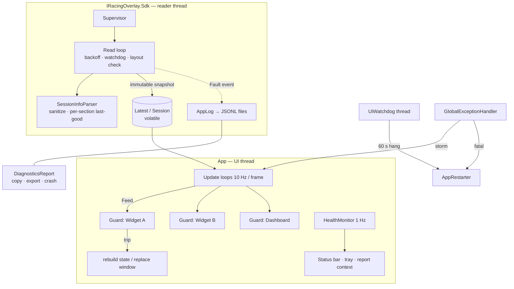

# OpenOverlay — Reliability Audit & Hardening for 12h/24h Endurance Use

> Companion to [analysis_report.md](analysis_report.md) (§11 Error Handling, §14 Observability, QW1–QW4).
> Everything under "Fixed" is implemented in the working tree and covered by tests.
>
> | Check | Result |
> |---|---|
> | Solution Release build, `--no-incremental` | **0 warnings, 0 errors** |
> | Tests | **389 / 389 passing** — SDK 13 → 44, App 308 → 345 |
> | Reader-loop tests | Run against a real named shared-memory block + data event (stall, restart, corrupt YAML, bad subscriber, sim exit); 5 repeated runs, no flakes |
> | Startup path & crash report | Exercised on Windows via harness: JSONL log written, crash handler produced a full report, profile path masked |
> | Control Panel | Rendered from production XAML: stalled-telemetry pill, live health line, General › Diagnostics |

---

## 1. Executive summary

**Before:** a single fault in almost any layer could end or silently freeze the overlay mid-race, with no evidence left behind.

- **One unusual team name blanked every widget for the whole race.** iRacing writes driver/team names unquoted; `TeamName: [TAG] Racing` is invalid YAML. The parse exception escaped the reader, which disconnected, reconnected a second later, hit the same YAML and looped: widgets showed "Waiting for iRacing" for as long as that driver stayed in the session. `Team #44` was worse — valid YAML, silently read as `Team`.
- **A frozen sim was shown as live forever.** No stall detection: the same buffer was republished as "connected" every 250 ms.
- **Any exception on the UI thread closed the app.** No `DispatcherUnhandledException`/`AppDomain`/`TaskScheduler`/WinForms handlers; both update loops had only `try/finally`; settings writes, hotkeys, tray clicks and buttons all ran unguarded on the UI thread.
- **A corrupt settings file permanently wiped the layout** (non-atomic writes; parse failure → empty → next save overwrote it).
- **Zero diagnostics:** no log file, no crash report, no version, no health state.

**Now:** failure is *contained, logged, recovered and visible* at every layer.

| Layer | Mechanism |
|---|---|
| iRacing SDK | Supervisor + exponential backoff with jitter; stall watchdog (Stale 5 s → release & reopen 30 s, frozen tick never republished); layout re-read on change/restart; YAML always sanitized, per-section last-good fallback; subscriber faults contained |
| Services | Update service: cancellable, timeouts, bounded retries, **never downloads while iRacing is running**; UI-thread watchdog |
| Domain/builders | Each builder runs in a per-widget circuit breaker; failure → state rebuilt, previous state stays on screen |
| Widgets | Per-widget bulkhead: a failing window is replaced alone; windows closed with Alt+F4 are no longer reused (crash) |
| Process | Global handlers; exception-storm escalation; fatal crash or 60 s UI hang → crash report + automatic relaunch (loop-guarded) |
| Persistence | Atomic write (temp + `File.Replace`) with `.bak`; corrupt file → restore from backup; I/O failures never throw |
| Observability | Structured JSONL rolling logs with duplicate suppression; health model (Healthy/Degraded/Failed); Copy diagnostics / Export report |

**Top residual risks** (see §9): no single-instance guard; tracker state isn't persisted across a *process* restart; layout-pass exceptions can't be attributed to one widget (whole overlay set is rebuilt); .NET 8 EOL on Nov 10, 2026.

---

## 2. Ranked findings

| ID | Severity | Finding (before) | Where | Status |
|---|---|---|---|---|
| R1 | **Critical** | Session-info YAML parse error disconnected telemetry and looped forever while the offending driver was in the session | `IRacingConnection.RunConnectedLoop` (parse inside the read path) | **Fixed** — [SessionInfoParser.cs](IRacingOverlay.Sdk/SessionInfoParser.cs#L39), [IRacingConnection.cs](IRacingOverlay.Sdk/IRacingConnection.cs#L341) |
| R2 | **Critical** | No global exception handlers; one UI-thread exception closed the overlay mid-race | [App.xaml.cs](IRacingOverlay.App/App.xaml.cs#L25) | **Fixed** — [GlobalExceptionHandler.cs](IRacingOverlay.App/Diagnostics/GlobalExceptionHandler.cs) |
| R3 | **Critical** | Update loops unguarded: any builder/widget exception propagated to the dispatcher | `MainWindow.UiTimer_Tick`, `OnFrame` | **Fixed** — per-widget guards, [MainWindow.xaml.cs](IRacingOverlay.App/MainWindow.xaml.cs#L402) |
| R4 | **Critical** | Hung sim: frozen snapshot republished as live, indefinitely | `ReadLatestTickWithRetry` + loop | **Fixed** — watchdog + `_stalledAtTick`, [IRacingConnection.cs](IRacingOverlay.Sdk/IRacingConnection.cs#L318) |
| R5 | High | Settings writes threw `IOException`/`UnauthorizedAccessException` into UI handlers (AV/OneDrive lock, disk full) → crash; corrupt file silently reset and was overwritten | 15 `*Store` classes | **Fixed** — [SettingsFile.cs](IRacingOverlay.App/Overlay/SettingsFile.cs) |
| R6 | High | Throwing `TelemetryUpdated`/`Connected` subscriber tore the connection down each tick | SDK event invocation | **Fixed** — per-subscriber containment, `Fault` event |
| R7 | High | Var headers cached per mapping handle; sim restarted in place → stale offsets → garbage values | SDK | **Fixed** — tick-restart detection, header match, 5 s byte-compare (`VarLayout`) |
| R8 | High | Widget closed with Alt+F4 (edit mode) left a dead window in its slot; next `Show()` threw `InvalidOperationException` | [WidgetSlot.cs](IRacingOverlay.App/ControlPanel/WidgetSlot.cs#L338) | **Fixed** — slot drops the window and switches the widget off |
| R9 | High | Same for the dashboard (closed window reused) | `MainWindow.CreateDashboard` | **Fixed** — [MainWindow.xaml.cs](IRacingOverlay.App/MainWindow.xaml.cs#L778) |
| R10 | High | Tray-menu exceptions showed WinForms' modal "Continue/Quit" dialog over the sim | `TrayIcon` callbacks | **Fixed** — `Application.ThreadException` + `CatchException` mode |
| R11 | High | One widget failing to construct aborted `MainWindow` ctor → app never started | `RestoreVisibleWidgets` → `WidgetSlot.Apply` | **Fixed** — `Apply` contained per slot ("COULD NOT OPEN") |
| R12 | High | No logs, crash reports, version or health anywhere | — | **Fixed** — [Diagnostics/](IRacingOverlay.App/Diagnostics/) |
| R13 | Medium | Stateful trackers (fuel, pit stops, best laps, flag timers) leaked across events after a sim restart (another car's fuel burn) | `MainWindow` fields | **Fixed** — event key reset; same-event rejoin keeps state ([ObserveSession](IRacingOverlay.App/MainWindow.xaml.cs#L864)) |
| R14 | Medium | `WaitExitThenApplyUpdates` spawned an updater that waited 60 s then gave up; a crash inside that window raced file replacement | `App.CheckForUpdatesAsync` | **Fixed** — relies on Velopack auto-apply on next start ([UpdateService.cs](IRacingOverlay.App/UpdateService.cs)) |
| R15 | Medium | Update download could start mid-race (bandwidth vs netcode), no timeout/cancellation | same | **Fixed** — deferred while connected, timeouts, cancellation |
| R16 | Medium | `Stop()` could dispose the CTS the reader was still waiting on; `Start()` lambda read `_cts` late (NRE) | SDK | **Fixed** (turn 1) |
| R17 | Medium | Button actions (`Process.Start`, clipboard) unguarded | `RelayCommand` | **Fixed** — [SettingItems.cs](IRacingOverlay.App/ControlPanel/SettingItems.cs#L570) |
| R18 | Medium | `VelopackApp.Run()` failure prevented startup | `App.Main` | **Fixed** — contained, app starts without updates |
| R19 | Medium | No single-instance guard (two instances fight over hotkeys/files) | `App.Main` | **Open** — §8 step 2 |
| R20 | Medium | Layout/render exceptions can't be attributed to a widget; storm recovery rebuilds all windows | WPF layout pass | **Mitigated** — storm detector; attribution is §8 step 5 |
| R21 | Low | Settings still written synchronously per change (opacity slider) | stores | **Open** — debounce, §8 step 6 |
| R22 | Low | `Latest`/`Session` read separately → one tick of mismatch after a session change | UI loop | **Mitigated** — guards contain it; atomic pair is §8 step 7 |

---

## 3. Exception handlers — before → now

| Entry point | Before | Now |
|---|---|---|
| `Application.DispatcherUnhandledException` | none → process exit | Logged, handled; storm (20 in 10 s) → rebuild overlays; 3 storms in 5 min → relaunch. Fatal types (OOM, AV, SEH) left to the crash path |
| `AppDomain.UnhandledException` | none | Critical log + crash report + relaunch (loop-guarded) + flush |
| `TaskScheduler.UnobservedTaskException` | none | Logged, `SetObserved()` |
| WinForms `Application.ThreadException` (tray) | modal dialog | Logged, contained, counted in the storm detector |
| `UiTimer_Tick` / `OnFrame` | `try/finally` | Every step in a `ComponentGuard` |
| Reader thread | catch-all per iteration, parse inside it | Supervisor + per-stage containment; session info isolated; subscribers isolated |
| `WidgetSlot.Apply` | none | Contained per slot |
| `RelayCommand.Execute` | none | Contained |
| Settings reads/writes | `JsonException` only on read; none on write | All I/O and parse errors contained, backup restore |
| `VelopackApp.Run()` | none | Contained |

## 4. Recovery mechanisms added

| Failure | Recovery | Bound |
|---|---|---|
| Telemetry read error | Backoff 1 s → 30 s (×2, ±20 % jitter), reset on first good tick | continuous |
| Reader loop itself throws | Supervisor restarts it after 30 s | continuous, counted |
| Sim stalls | *Stale* at 5 s (last values kept), release mapping at 30 s, reopen; frozen tick never republished | continuous |
| Sim restarted in place | Tick counter drop → layout, session and counters re-read | immediate |
| Session info unparseable | Sanitize → per-section parse keeping last-good sections; failing update not retried until iRacing publishes a new one | per update |
| Builder throws | Guard: 3 in a row → state object recreated, cooldown 1 → 60 s, retried | per widget |
| Widget window throws | Guard trip on the Render stage → window replaced (position kept) | per widget |
| Dashboard throws | Dashboard window replaced, reopened on the same monitor | per trip |
| Exception storm | Rebuild all overlay windows → escalate to relaunch | 30 s cooldown, 3 per 5 min |
| Fatal crash | Crash report + relaunch with `--recovered --wait-for-pid` | 3 per 10 min |
| UI thread hang | Logged at 10 s (health *Failed*); at 60 s crash report + relaunch + self-kill | once per hang; skipped under debugger/suspend |
| Corrupt settings | Restore `.bak`, corrupt copy set aside as `.corrupt` | per file |
| Update check fails | Retries at 5 min, 30 min, 2 h; then next launch | 3 |
| New event after reconnect | Per-session trackers reset; same event → state kept | per session |

## 5. Race conditions

| Race | Resolution |
|---|---|
| UI read reader-thread auto-properties (`Latest`, `Session`, `IsConnected`) | Volatile fields; immutable snapshots |
| `Stop()` disposing a CTS the reader still waits on | Dispose only after the loop finished |
| `Start()` task reading `_cts` after `Stop()` | Token captured before the task starts |
| Crash-relaunch vs. the old process's hotkeys/tray/files | New process waits for the old PID (`--wait-for-pid`, 15 s) |
| Crash within 60 s of an update download vs. Velopack updater replacing files | `WaitExitThenApplyUpdates` removed |
| Session YAML rewritten while being copied | Update counter re-checked after the copy; torn copy discarded |
| External window close vs. slot reuse | Slot drops the window in `Closed`; deferred switch-off never runs during shutdown |
| Two crash paths at once (domain + storm/hang) | Single `Interlocked` terminate/relaunch gate |
| Logger from 4 threads | Lock around suppression + ring; bounded queue to one writer thread |

## 6. Memory & handle review (24 h)

| Item | Result |
|---|---|
| Widget/dashboard windows recreated by recovery | No static subscriptions to widgets; options are DPs bound via WPF weak events; `Closed` handler removed on discard; cockpit flash timer stops on `Unloaded` — **no leak** |
| Log volume | Identical entries collapsed per 60 s (a 60 Hz failure = 1 line/min); files rolled at 10 MB, 14 days, 100 MB cap; queue bounded to 10 000 |
| Diagnostics buffers | Ring of 500 entries; suppression map pruned past 2 000 keys; crash reports capped at 20 |
| Trackers | Keyed by CarIdx (≤ 64) or bounded windows; fuel lap history grows one double per lap (~1 000 in 24 h) |
| Mapping/event handles | Disposed on every reopen path (`finally`) |
| Tray icons / hotkeys | Disposed on exit (unchanged) |

## 7. Architecture



**Patterns applied:** Supervisor (reader), Circuit breaker + Bulkhead (`ComponentGuard` per widget, per stage), Watchdog (sim stall, UI hang), Last-known-good (standings order, session sections, settings `.bak`), Atomic replace, Crash-only restart with loop guard, Structured logging with duplicate suppression, Health aggregation.

**Contract for new widgets:** push state only through `Feed(key, widget, build, toWidget, toDashboard)` and clear through `Clear(...)` — both are already isolated.

```csharp
// MainWindow: one line per widget; build and render are guarded separately.
Feed(WidgetCatalog.Fuel, Fuel, () => _fuelBuilder.Build(telemetry),
    (widget, state) => widget.UpdateState(state), (dashboard, state) => dashboard.UpdateFuel(state));
```

## 8. Prioritized action plan (highest business impact first)

| # | Action | Impact | Status |
|---:|---|---|---|
| 1 | Crash-proof loops, global handlers, resilient reader, atomic settings, logs, health, crash reports, relaunch | Removes "overlay died mid-race" | **Done** |
| 2 | Single-instance named mutex; second launch activates the running Control Panel | Prevents hotkey/file contention | Next |
| 3 | Persist per-session tracker state (fuel laps, pit stops, best laps) keyed by subsession, restored after a crash-relaunch | Relaunch without losing strategy data | Next |
| 4 | Retarget `net10.0-windows` + ReadyToRun in `release.yml` | Runtime security fixes after Nov 10, 2026 | Next |
| 5 | Attribute layout/render exceptions to a widget (stack → panel type → slot) so storms replace one window, not all | Narrower recovery | Planned |
| 6 | Debounce settings writes (250 ms) off the UI thread | Removes remaining UI-thread I/O | Planned |
| 7 | `ITelemetrySource` + recorder/replay; chaos tests replaying captured stalls/restarts through the full UI loop | Regression-proof reliability | Planned |
| 8 | Extract `TelemetryLoop` from `MainWindow`; `IWidgetModule` registry | Smaller blast radius per change | Planned |
| 9 | SDK `TryGet*` reads (no exception-driven type probing in `DeltaBuilder`/`FlagBuilder`) | Less per-tick exception noise | Planned |
| 10 | Optional, opt-in crash upload (keeps the local-only promise by default) | Field data | Later |

## 9. 24-hour soak checklist (manual, before release)

1. Kill `iRacingSim64DX11.exe` mid-session → "WAITING FOR IRACING", widgets cleared, log `Disconnected`; relaunch and rejoin → "Rejoined the same event; session state kept".
2. Suspend the sim process (Resource Monitor) 40 s → pill *TELEMETRY STALLED* at 5 s, *RECONNECTING* at 30 s; no frozen data shown as live; resume → recovers.
3. Join a session with a driver/team named `[X] Test: #1` → names intact, no telemetry gap.
4. Lock `layout.json` (open exclusively) and move a widget → health *Degraded · Settings*, no crash; unlock → saves.
5. Corrupt `layout.json` → next start restores from `.bak`, `.corrupt` kept.
6. Alt+F4 a widget in edit mode → widget switches off in the rail; re-enable works.
7. Disconnect network during update check → *Updates* degraded, retries, overlay unaffected.
8. Run 24 h with all widgets + dashboard: working set flat, log directory < 100 MB, General › Diagnostics › Export produces a zip.
